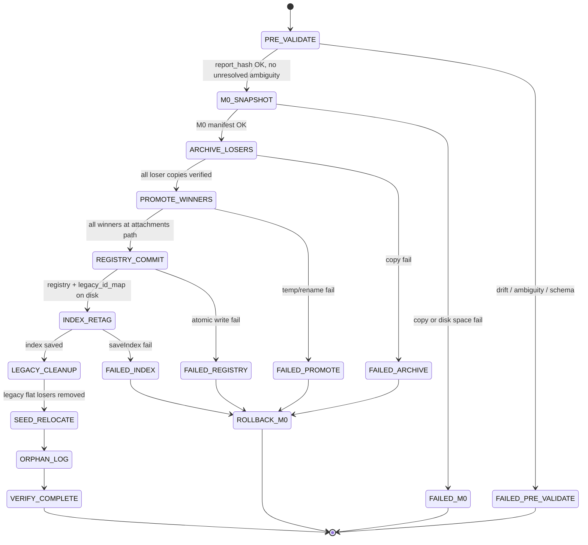
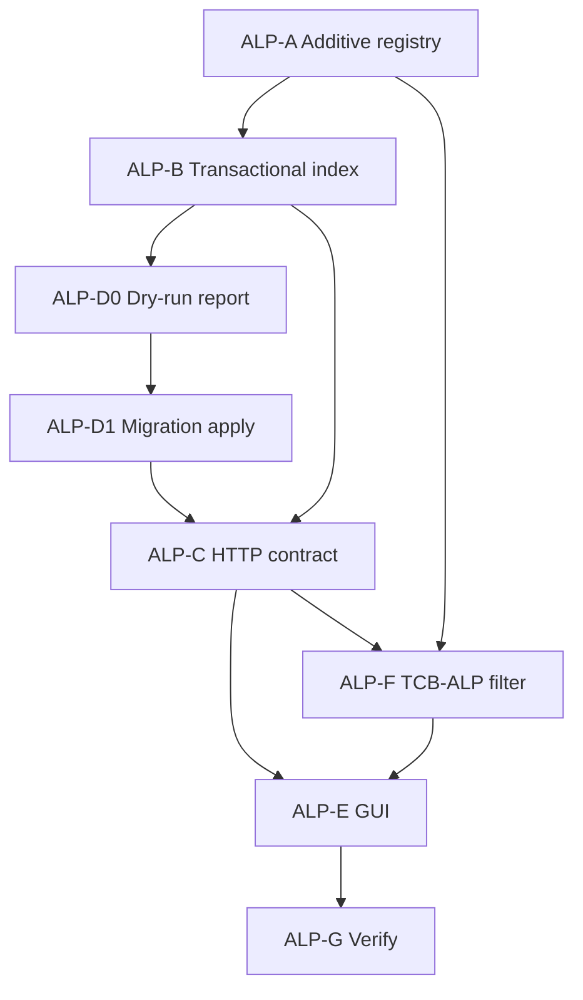

# ALP1 Implementation Plan

**Document type:** Implementation plan (Attachment Lifecycle Protocol ALP1)  
**Status:** **ALP1-PLAN 🔒 LOCKED** **2026-07-26** — implementation authorized  
**Created:** 2026-07-26  
**Locked:** 2026-07-26  
**Protocol:** [`ATTACHMENT_LIFECYCLE_PROTOCOL.md`](ATTACHMENT_LIFECYCLE_PROTOCOL.md) **ALP1 🔒**  
**Analysis:** [`attachment_state_analysis.md`](attachment_state_analysis.md)  
**Gate:** Human approval received **2026-07-26** — implement per phased gates below.

---

## Purpose

Translate locked ALP1 protocol into a **phased, verifiable implementation sequence** for the Thoth GUI ↔ Engine attachment lifecycle.

**This document authorizes nothing.** It is the plan submitted for approval.

---

## Plan safety review (pre-approval)

**Review date:** 2026-07-26  
**Protocol:** ALP1 🔒 locked — plan-only review, no implementation.

### Q1 — Can ALP-A make the existing corpus unreadable before migration?

**Original plan risk: YES**, if ALP-A replaces the path-key registry, changes `listCorpusDocuments` to registry-only, or refactors `createCorpusDocument` (suffix removal, new storage paths) before brownfield migration.

**Adjusted plan: NO** — ALP-A is split into **additive scaffolding only**:

- New `document_registry` store **alongside** legacy `rag_attachment_registry.json` and flat `rag/` layout
- **Dual-read:** corpus list and retrieval continue to serve legacy paths until ALP-D apply + flag enable
- **No write-path switch** until `THOTH_ALP_ENABLED=1` after ALP-D (brownfield) or greenfield install
- Namespace directories created empty; **no bulk relocate** in ALP-A (relocate is ALP-D M5)

### Q2 — Must transactional indexing (ALP-B) precede replacement/resend enablement?

**YES.** Replace/resend creates new revisions that re-index committed documents. Without ALP-B, resend reintroduces delete-live-first degradation (INV-1 violation).

**Adjusted sequencing:** ALP-B **must complete and verify** before ALP-C is enabled on any workspace (brownfield or greenfield).

### Q3 — Mandatory migration dry-run before archive actions?

**Original plan gap: YES** — dry-run was not explicit.

**Adjusted plan:** ALP-D split into **ALP-D0 (dry-run report)** and **ALP-D1 (apply)**. Apply is **blocked** until operator approves dry-run output. Archive/copy actions occur only in D1.

### Q4 — Can the Engine operate safely between each phase?

**Adjusted plan:** **Yes**, with feature flags and dual-read (see **Phase compatibility matrix** below). Each phase leaves legacy ingest/retrieval functional until explicit flag enablement after ALP-D1 (brownfield).

### Q5 — Rollback points after each phase?

**Original plan gap:** Only global rollback listed.

**Adjusted plan:** **Per-phase rollback table** added below. Each phase ends with a verification gate before the next.

### Q6 — API contracts defined before GUI changes?

**Original plan: Mostly yes** (C before E), but C before D on brownfield risked GUI/API mismatch with legacy ids.

**Adjusted plan:** ALP-C (HTTP contract + backend bridge **without GUI picker changes**) completes and tests freeze contract **before** ALP-E. GUI continues legacy picker until `THOTH_ALP_GUI=1` after ALP-C + ALP-D1.

### Q7 — Invariants preserved per phase?

See **Invariant gate matrix** below. Sequencing adjustments ensure no phase enables behavior that violates locked invariants.

---

## Feature flags (phase safety)

| Flag | Purpose |
|------|---------|
| `THOTH_ALP_ENABLED=0` (default) | Legacy ingest, list, retrieval unchanged |
| `THOTH_ALP_ENABLED=1` | New registry write path, UUID ids, no suffix, new storage layout (**requires `THOTH_ALP_TX_INDEX=1`** — ALP-C §7) |
| `THOTH_ALP_GREENFIELD=1` | Skip ALP-D; empty workspace only |
| `THOTH_ALP_TX_INDEX=1` | ALP-B transactional indexing (may ship before full ALP enable; improves legacy reindex safety) |
| `THOTH_ALP_GUI=1` | ALP-E picker/reconcile UX (requires ALP-C contract stable) |

**Brownfield rule:** `THOTH_ALP_ENABLED=1` requires ALP-D1 complete **and** `THOTH_ALP_TX_INDEX=1`.  
**Greenfield rule:** `THOTH_ALP_GREENFIELD=1` may set `THOTH_ALP_ENABLED=1` without D.

---

## Phase map (revised)

```
ALP-A   Additive registry + dual-read scaffolding (legacy write unchanged)
  ↓
ALP-B   Transactional indexing (THOTH_ALP_TX_INDEX; legacy paths OK)
  ↓
ALP-D0  Migration dry-run report (mandatory before apply)
  ↓
ALP-D1  Migration apply + archive (brownfield gate for ALP enable)
  ↓
ALP-C   Send/replace HTTP contract + backends (THOTH_ALP_ENABLED=1)
  ↓
ALP-F   TCB-ALP retrieval filter
  ↓
ALP-E   GUI reconciliation + picker (THOTH_ALP_GUI=1)
  ↓
ALP-G   Verify + operator smoke
```

Phases are **sequential**. Gates:

- Do **not** set `THOTH_ALP_ENABLED=1` on brownfield until **ALP-D1** passes.
- Do **not** set `THOTH_ALP_GUI=1` until **ALP-C** contract tests pass.
- Do **not** enable replace/resend (ALP-C) until **ALP-B** verifies.

---

### In scope

- Engine document registry (UUID identity, revisions, session links)
- Physical namespace layout (`rag/seed/`, `rag/attachments/`, `rag/revisions/`)
- Transactional indexing (candidate → validate → commit)
- Send/replace decision tree + `force_replace` + 409 in-flight conflict
- Legacy migration M0–M8 + migration archive
- GUI reconciliation, Engine-backed picker intent, cache model
- TCB-ALP retrieval filter (session link + `document_id` on chunks)
- Corpus inventory derived view (one row per UUID `document_id`)
- Unit + integration tests; TCB-X4 re-baseline

### Out of scope (ALP1)

- Remove from Engine operator UI (soft evict spec only; UI deferred)
- Admin purge UI (API stub acceptable)
- Cross-session “shared knowledge” tier beyond session links
- GRAG weight / scorer changes
- Index on-disk format v2 metadata (unless required for `document_id` tag — prefer runtime + registry)

## Implementation policy defaults (plan-level)

Numeric policies deferred from protocol — locked for implementation:

| Policy | Value |
|--------|-------|
| **Min committed chunks** | ≥ 1 valid chunk after validate |
| **Embed success threshold** | ≥ 95% of generated candidate chunks embedded successfully |
| **Indexing worker timeout** | 600 s per revision (configurable) |
| **Intent API** | Extend `POST /v1/rag/documents` with `dry_run: true` (phase 1); optional dedicated `/intent` later |
| **Conflict UX** | wx confirm dialog showing local vs committed hash + mtimes; sets `force_replace: true` on confirm |
| **Evict default** | Soft evict (registry `evicted`); hard delete admin-only |
| **Greenfield flag** | `THOTH_ALP_GREENFIELD=1` skips ALP-D0/D1; empty workspace only |

---

## Phase compatibility matrix

Engine must remain operable for legacy GUI + legacy corpus at each boundary (default flags off).

| After phase | Legacy ingest | Legacy list/retrieval | New ALP send | Rollback |
|-------------|---------------|----------------------|--------------|----------|
| **ALP-A** | ✅ unchanged | ✅ dual-read adds empty registry | ❌ | Delete new registry file |
| **ALP-B** | ✅ unchanged | ✅; reindex safer if `TX_INDEX=1` | ❌ | Disable `TX_INDEX`; legacy index path |
| **ALP-D0** | ✅ | ✅ | ❌ | N/A (read-only dry-run) |
| **ALP-D1** | ⚠️ legacy paths migrated | ✅ via new registry + legacy_id_map | ❌ until flag | Restore M0 snapshot |
| **ALP-C** | ❌ when `ENABLED=1` | ✅ ALP paths | ✅ | `ENABLED=0` + snapshot if needed |
| **ALP-F** | — | ✅ scoped retrieval | ✅ | `ENABLED=0` |
| **ALP-E** | — | ✅ | ✅ + new GUI | `GUI=0`; keep Engine |
| **ALP-G** | — | ✅ certified | ✅ | Release rollback notes |

---

## Per-phase rollback points

| Phase | Pre-phase snapshot | Rollback action | Verification before next phase |
|-------|-------------------|-----------------|-------------------------------|
| **ALP-A** | Optional | Remove `document_registry.json`; no index change | Legacy tests green; registry loads empty |
| **ALP-B** | `rag_index.bin` copy | `THOTH_ALP_TX_INDEX=0`; restore index backup if commit bug | Embed-failure regression test |
| **ALP-D0** | None (read-only) | Discard report | Human sign-off on dry-run JSON |
| **ALP-D1** | **M0 mandatory** (`rag/`, `rag_index.bin`, `rag_attachment_registry.json`, `chat_sessions.json`, `document_registry.json`) | **ROLLBACK_M0** — stop Engine; restore M0 tree; delete post-D1 `legacy_id_map.json`; `ENABLED=0`; retain snapshots/archive/logs (see D1 safety review §5) | Inventory row count stable; no suffix in active registry; `deferred_repairs` logged; ambiguity abort tested |
| **ALP-C** | M0 or post-D1 snapshot | `ENABLED=0`; legacy POST path if retained | HTTP contract tests + 409/force_replace |
| **ALP-F** | Index + registry | Revert filter module; `ENABLED=0` | TCB-X1/X2/X4 |
| **ALP-E** | `chat_sessions.json` | `GUI=0`; legacy picker | Reconcile + picker tests |
| **ALP-G** | Tagged release snapshot | Documented operator restore procedure | Smoke checklist |

---

## Invariant gate matrix

| Invariant | A | B | D0 | D1 | C | F | E |
|-----------|---|---|----|----|---|---|---|
| Failed indexing never destroys committed data | — | ✅ | — | — | ✅ | — | — |
| No suffix duplicates | — | — | — | ✅ | ✅ | — | — |
| Engine authoritative | ✅ dual-read | ✅ | — | ✅ | ✅ | ✅ | ✅ |
| Picker not GUI-only stale | — | — | — | — | ✅ API | — | ✅ GUI |

---

## API contract freeze

**Freeze point:** End of **ALP-C** (before ALP-E).

Frozen artifacts (implementation — see **ALP-C safety review**):

- `corpus_create.h` / POST body: `content_hash`, `local_source_mtime`, `force_replace`, `dry_run`
- Response: UUID `document.id`, `revision_id`, `action` enum; HTTP `"accepted"` = sync accept only (not COMMITTED)
- Error codes: `409 revision_in_flight`, `409 content_conflict`; `503/400 alp_misconfigured` if ENABLED without TX_INDEX
- Lifecycle: ACCEPTED → INDEXING → COMMITTED | FAILED; prior → SUPERSEDED
- `GET /v1/rag/corpus` operator tier: one row per UUID (when `ENABLED=1`)
- **Retrieval isolation:** ALP-F required for TCB session filter — not part of C freeze

ALP-E MUST NOT invent parallel semantics; GUI consumes frozen contract only.

---

## Phase ALP-A — Additive registry and dual-read (legacy write unchanged)

### Goal

Introduce **`document_registry`** and namespace directories **without** breaking legacy corpus read/write.

### Deliverables

1. **Registry store** (new file, e.g. `agent_workspace/document_registry.json`):
   - Schema: `documents`, `revisions`, `session_links` (may be empty initially)
   - **Does not replace** `rag_attachment_registry.json` in this phase

2. **Namespace directories** created on Engine init (may be empty):
   - `rag/attachments/`, `rag/revisions/`, `rag/seed/` (seed relocate deferred to ALP-D1)

3. **Dual-read adapters:**
   - `listCorpusDocuments`: legacy scan **unchanged** when `THOTH_ALP_ENABLED=0`
   - Optional: merge ALP registry rows when flag on (future)

4. **Do NOT in ALP-A:**
   - Refactor `createCorpusDocument` write path
   - Remove suffix collision loop
   - Change chunk keys or retrieval filter
   - Relocate existing files

5. **Feature flag plumbing** (`THOTH_ALP_ENABLED`, `THOTH_ALP_TX_INDEX`, `THOTH_ALP_GUI`, `THOTH_ALP_GREENFIELD`)

### Primary files (expected)

| Area | Files |
|------|-------|
| Engine core | `external/basic_agent/include/document_registry.h`, `external/basic_agent/src/document_registry.cpp` |
| Index | `index_manager.cpp` — read hooks only |
| Config | env/flag parsing |
| Tests | Registry CRUD; legacy list unchanged with flag off |

### Verification

- [ ] Full legacy unit suite green with empty ALP registry present
- [ ] `listCorpusDocuments` output identical to pre-ALP-A with `ENABLED=0`
- [ ] Legacy ingest + retrieval smoke unchanged

### Rollback

Delete `document_registry.json`; remove flag checks (no-op default).

### Risks

- Accidental early write-path switch — code review gate: **no `createCorpusDocument` changes in ALP-A**

---

## Phase ALP-B — Transactional indexing

### Goal

Replace **delete-live-first** indexing with **candidate → validate → commit** (INV-1, INV-8, INV-16).

### Sub-phase scope (locked for safety review)

| Sub-phase | Scope | Explicitly out of scope |
|-----------|--------|-------------------------|
| **B2** | Legacy path-keyed indexing: failed attempt never destroys an existing committed in-memory index | Migration (D0/D1), GUI (E), send/replace HTTP (C), retrieval filter (F), namespace promotion to `rag/attachments/` |
| **B3** | Revision artifact dirs under `rag/revisions/{document_id}/{revision_id}/` | Migration apply, GUI, inventory API changes |
| **B4** | Registry revision state transitions when `document_id`/`revision_id` are supplied | Backfill of legacy rows; D1 hash-merge |
| **B5** | `INDEXING_COMPLETED` metadata (`document_id`, `revision_id`, reason codes) | GUI consumption (E); picker changes |
| **B6** | Persistence timing, atomic `saveIndex`, worker serialization | Full INV-11 HTTP 409 (C); queue across processes |

**B2 gate (minimum shippable ALP-B):** Sub-phase **B2 must pass verification alone** before D0 or C. B3–B6 may follow in the same phase branch but must not block B2 acceptance and must not pull migration or GUI work into B2 PRs.

### Deliverables

1. **Candidate build** in worker: chunks + embeddings tied to `revision_id` under `rag/revisions/{document_id}/{revision_id}/` **(B3 — not B2)**
2. **Validate gate**: min chunks + embed threshold — see **Validation policy (normative)** below **(B2)**
3. **Commit**: atomic in-memory swap for path or `document_id`; update `current_revision_id`; copy/promote bytes to `rag/attachments/{canonical_name}` **(in-memory swap B2; attachment promotion B3/C only)**
4. **Abort**: revision `failed`; live index and committed file unchanged **(B2 in-memory; registry durable failure B4)**
5. **Remove** early `removeChunksForFile` from re-index path (or restrict to commit phase only) **(B2 — partial ✅)**
6. **Durable failure state** in registry (not ephemeral `indexingFailureReasons_` only) **(B4 — not B2)**
7. **`INDEXING_COMPLETED`** events include `revision_id`, `document_id` **(B5 — not B2)**

### Primary files

| Area | Files |
|------|-------|
| Index | `index_manager.cpp` — `indexFile` / new `indexRevisionCandidate` + `commitRevision` |
| Registry | `document_registry.cpp` — revision state transitions **(B4)** |
| Events | existing `ControllerEvent` metadata **(B5)** |

### Verification

- [ ] Inject embed failure mid-reindex → prior chunk count unchanged **(B2)**
- [ ] Failed revision → registry `failed`; committed revision still retrievable **(B4)**
- [ ] Successful commit → new chunk count; old revision `superseded` **(B4)**
- [ ] Regression: EGAR-style large doc does not drop 95 → 5 on transient 500 **(B2)**
- [ ] **Persistence failure:** in-memory commit succeeds, `saveIndex` fails → prior on-disk index unchanged and reloadable **(B6 — see safety review §1)**

### Rollback

`THOTH_ALP_TX_INDEX=0`; restore `rag_index.bin` from phase backup if needed.

### Gate before ALP-D0

**B2 verification must pass** (embed-failure + persistence-failure cases). B3–B6 may remain open but must not block D0. **Do not enable ALP-C until full ALP-B (B2–B6 as applicable) passes.**

### Risks

- `saveIndex` timing — commit must persist only after validate; queue ordering with worker mutex **(B6)**
- Memory pressure for large candidate sets — cap batch same as today
- ALP-B transactional path on **legacy flat paths** must not assume ALP registry rows exist until D1 — index by file path until `ENABLED=1`

---

## ALP-B safety review (pre-implementation 🔒)

**Date:** 2026-07-26  
**Purpose:** Final safety review before remaining ALP-B implementation. **Direction approved;** this section locks commit boundaries, B2 scope, validation math, persistence-failure recovery, and worker serialization. **No code in this review.**

### 1. Transactional commit boundary

Indexing is **two-layer**: (A) **in-memory index commit** and (B) **disk persistence**. INV-1 applies to both; recovery differs by layer.

#### Phase pipeline (normative)

| Step | Name | Mutates live `chunks`? | Mutates `rag_index.bin`? | Fingerprint update |
|------|------|------------------------|--------------------------|-------------------|
| 1 | **Read + chunk** | No | No | No |
| 2 | **Candidate embed** | No (side buffer only) | No | No |
| 3 | **Validate** | No | No | No |
| 4 | **In-memory commit** | **Yes** — remove prior chunks for key, insert validated candidates under `chunksMutex` | No | **Deferred until step 6 succeeds (B6)** |
| 5 | **Persist** (`saveIndex`) | No (already committed in RAM) | **Yes** — full index snapshot write | No |
| 6 | **Post-persist metadata** | No | No | **Yes** — `indexedFileFingerprints` only after successful persist |

**Transactional commit boundary (logical):** Step **4** completes under `chunksMutex`. Steps **1–3** are fully abortable with zero live-index mutation. Step **4** must not run unless step **3** passes.

#### If in-memory commit succeeds but `saveIndex` fails (step 5)

| Concern | Behavior (required) |
|---------|---------------------|
| **In-process retrieval** | Serves **new** chunks (RAM is authoritative until restart) |
| **On-disk state** | **`rag_index.bin` unchanged** — still reflects **prior committed** snapshot (today's writer truncates in place; B6 must add detectable failure + no silent truncate) |
| **Fingerprint** | **Must not advance** until persist succeeds — avoids skipping reindex of “unsaved commit” after restart |
| **Outcome / event** | `success=false`, `reason=persist_failed` (B5/B6); prior revision remains the **committed** revision in registry when IDs exist (B4) |
| **Recovery guarantee** | **On Engine restart:** `loadIndex()` reloads prior on-disk snapshot → **prior committed index fully recoverable**. Operator may retry indexing; failed persist does not corrupt the previous binary (B6: write to temp + atomic rename; keep last good file on failure) |
| **INV-1 interpretation** | A failed **attempt** did not destroy the **last durably committed** index on disk. A successful in-memory commit with failed persist is a **divergence window** bounded to process lifetime; recovery path is restart + optional explicit reindex |

**B6 requirement:** `saveIndex` must use **write-temp → fsync → atomic rename** over `rag_index.bin`, and return **bool success**. On failure, in-memory state may remain new, but fingerprint stays stale and outcome is `persist_failed` so operators and tests can detect the gap.

---

### 2. B2 scope confirmation (locked)

**B2 solves exactly one problem:**

> **Failed indexing can never destroy an existing committed index.**

**B2 includes:**

- Skip early `removeChunksForFile` when `THOTH_ALP_TX_INDEX=1`
- Candidate → validate → in-memory commit for **path-keyed** legacy indexing
- Validation policy (below)
- Tests: empty reindex, embed-failure mid-reindex, EGAR-style regression

**B2 explicitly excludes (defer to later sub-phases / phases):**

| Excluded item | Owner phase |
|---------------|-------------|
| Migration dry-run / apply | D0, D1 |
| GUI picker, reconcile, Force Replace dialog | E |
| `POST` send/replace, 409 in-flight HTTP | C |
| TCB-ALP retrieval filter | F |
| Promote bytes to `rag/attachments/` | B3 / C (after D1 or greenfield) |
| Registry `failed` / `superseded` rows | B4 |
| `document_id` in completion events | B5 |
| Atomic `saveIndex` + persist-failure test | B6 |

**PR discipline:** B2 changes must not add migration tools, GUI files, or HTTP contract changes. B3–B6 are separate commits or follow-on PRs within ALP-B.

---

### 3. Validation policy (normative)

Locked numeric policy from plan-level defaults, with **exact definitions**:

#### Terms

| Term | Definition |
|------|------------|
| `chunks_generated` | Count of chunks emitted by the chunker (`createSmartChunks` / `chunkBySize` / whole-file fallback path) **before** embed |
| `skipped_empty` | Chunker output rows discarded: empty or whitespace-only body |
| `skipped_short` | Rows discarded: fewer than **10** non-whitespace characters (existing indexer rule) |
| `embed_attempts` | `chunks_generated − skipped_empty − skipped_short` |
| `embed_failures` | Rows that reached embed but threw or returned unusable embedding (tracked as `chunks_skipped_embed`) |
| `embed_ok` | `embed_attempts − embed_failures` |
| `commit_candidates` | Rows that pass `chunkHasRetrievalSignal` (non-zero semantic embedding **or** keyword score > 0.001) after embed |

#### Rules (all must pass to commit)

1. **Minimum committed chunks:** `commit_candidates ≥ 1`  
   - *Not* tied to document byte size. A 10 MB doc with zero valid chunks **must abort**.

2. **Embed success threshold (95%):** Applies to **embed attempts**, not raw `chunks_generated`, not document size.  
   - If `embed_attempts == 0` (e.g. whole-file fallback with no chunker rows): gate passes iff `commit_candidates ≥ 1`.  
   - If `embed_attempts > 0`: require `embed_ok × 100 ≥ embed_attempts × 95` (integer math, no rounding up).

3. **Document size:** Used only for **read limits** (`MAX_FILE_SIZE`) and **fallback strategy** (`kSmallDocumentSingleChunkMaxBytes`); **not** a validate-gate input.

4. **Abort behavior:** On any failed rule, **no in-memory commit** (step 4); live index and on-disk index unchanged.

#### Example

- Chunker emits 100 blocks → `chunks_generated = 100`  
- 2 empty, 3 short → `embed_attempts = 95`  
- 5 embed failures → `embed_ok = 90` → rate = 90/95 ≈ 94.7% → **abort** (even if `commit_candidates = 90`)

---

### 4. Persistence failure verification (required)

Add to B6 (and gate before D0):

**Test: `testAlpPersistFailurePreservesOnDiskCommit`**

1. Seed `rag_index.bin` with known chunk count **N** for document **D** (`TX_INDEX=1`).
2. Reindex **D** with content that validates and commits in memory to **M** chunks (M ≠ N).
3. Inject `saveIndex` failure (test hook or mock filesystem error on rename).
4. Assert:
   - On-disk `rag_index.bin` reload still yields **N** chunks for **D** (prior commit).
   - Outcome / event reports `persist_failed` (when B5/B6 land).
   - Fingerprint for **D** not advanced (B6).
5. Restart simulation: new `IndexManager` + `loadIndex()` → still **N** chunks for **D**.

**Acceptance:** Prior committed state remains **recoverable** without manual index surgery.

---

### 5. Worker serialization (current path → future identity)

#### Current behavior

- Single worker thread; FIFO `m_taskQueue`; one task runs to completion before the next.
- **Effective policy today:** at most one indexing operation in flight **globally** (includes `indexFile`, `indexProject`, `saveIndex` tasks).

#### Required policy (B6, compatible with ALP-C INV-11)

| Key era | In-flight lock key | Concurrent second accept |
|---------|-------------------|---------------------------|
| **Legacy (B2)** | Normalized absolute **file path** | Second `indexFile` for same path queued (serialized); no 409 yet |
| **ALP (C+)** | **`document_id`** (UUID) | **HTTP 409** `revision_in_flight` — no queue (**INV-11**) |
| **Transition (post-D1, pre-C)** | Prefer `document_id` when registry row exists; else path | Path-only legacy docs remain path-serialized until C |

**Implementation note (B6):** Introduce `inFlightIndexKeys_` (set of path or `document_id`) checked at **accept** time for ALP POST (C) and at **worker entry** for legacy async index. Worker remains single-threaded; the set prevents **logical** double-commit races when HTTP layer adds concurrent accepts. Path-only B2 does **not** implement 409 — only serialization via queue.

**Future-proofing:** When `revision_id` is assigned at accept, the in-flight key is **`document_id`**, not `revision_id` (one revision in flight per document). Different documents may index concurrently only if worker pool expands later; **ALP1 P0** keeps single worker — cross-document concurrency is out of ALP1 scope.

---

### ALP-B approval checklist

Before implementation of remaining B work:

- [x] Commit boundary defined (in-memory vs persist)
- [x] B2 scope bounded (no migration/GUI)
- [x] Validation policy numerically specified
- [x] Persistence failure test specified
- [x] Worker serialization keyed for path → `document_id`

**Human gate:** Respond **`Implement ALP-B`** (or equivalent) to authorize B2→B6 implementation per sub-phase scope above.

---

---

## Phase ALP-D0 — Migration dry-run (mandatory)

### Goal

Produce a **deterministic migration report** with **no mutations** to active corpus, registry, or index.

### Deliverables

1. **Dry-run command:** `thoth-migrate-alp --dry-run` or `POST /v1/rag/admin/migrate-alp { "dry_run": true }`
2. **Report JSON** (stdout or file):
   - Candidate groups by canonical stem
   - Content hashes per file
   - Proposed winner per group (protocol §8.5 rules — see **ALP-D0 safety review** below)
   - **Preview-only** UUID assignments (corpus-stable derivation; **not** migration authority — see safety review §3)
   - Files slated for **archive copy** (not delete) — **plan only in D0**
   - Chunk re-tag plan; orphan/legacy_orphan rows
   - **Warnings:** degraded indexes, missing storage, conflicting sessions, seed/operator ambiguity
3. **Zero writes** to `rag/attachments/`, `document_registry.json`, or active `rag_index.bin` (see safety review §5)
4. **Human approval gate:** ALP-D1 blocked until operator reviews report

### Verification

- [ ] Two dry-runs on same corpus → **identical `report_hash`** (canonical form — see safety review §1)
- [ ] No filesystem changes (mtime audit on `rag/`)
- [ ] Preview UUIDs absent from all persisted stores after dry-run

### Rollback

N/A (read-only)

---

## ALP-D0 safety review (pre-implementation 🔒)

**Date:** 2026-07-26  
**Purpose:** Final safety review before ALP-D0 implementation. **Direction approved;** this section locks determinism, winner selection edge cases, preview ID authority, seed classification, and read-only enforcement. **No code in this review.**

### 1. Deterministic report hashing

#### Two hash concepts (do not conflate)

| Field | Purpose | Included in determinism check? |
|-------|---------|--------------------------------|
| **`report_hash`** | Operator gate: two dry-runs on unchanged corpus must match | **Yes** — primary acceptance test |
| **`report_hash_input`** | Canonical serialized payload used to compute `report_hash` | N/A (implementation detail) |
| **`migration_run_id`** | Human/audit correlation id for logs and D1 archive folder name | **No** — diagnostic only |
| **`generated_at`** | ISO-8601 wall clock | **No** — diagnostic only |

#### Canonical payload rules (normative)

**`report_hash`** = SHA-256 of **canonical JSON** (`jq -S` stable key order, UTF-8, no insignificant whitespace) of the report **with these top-level keys removed**:

- `generated_at`
- `migration_run_id`
- `report_hash` (if present)

All **semantic** fields remain: `summary`, `groups`, `chunk_retag_plan`, `legacy_id_map_preview`, `warnings`, `planned_steps`, `schema_version`, `dry_run`, `workspace_root`.

**Answer:** Yes — `report_hash_input` (canonical form) **must exclude** `generated_at` and `migration_run_id`. Two identical dry-runs on an unchanged corpus **must** produce **identical `report_hash`**.

#### Additional determinism requirements

- Sort `groups` by `canonical_stem` (lexicographic).
- Sort `candidates` within a group by normalized absolute path (lexicographic).
- Sort `warnings` by `(code, path, detail)`.
- Preview UUID derivation (§3) uses **only** corpus-stable inputs — **not** `migration_run_id` or wall clock.

#### Verification

```bash
# Must match after excluding volatile keys:
jq 'del(.generated_at, .migration_run_id, .report_hash)' run1.json | sha256sum
jq 'del(.generated_at, .migration_run_id, .report_hash)' run2.json | sha256sum
```

---

### 2. Winner selection — “valid revision” and edge cases

#### Definition: **valid revision** (D0 analysis term)

A **valid revision candidate** is a row in a suffix group that meets **all** of:

1. **Readable artifact OR registry row:** file exists and is readable under sandbox, **or** registry row exists (missing file → **invalid** for winner, flagged `missing_storage`).
2. **Non-empty content hash:** SHA-256 computed over file bytes; empty/whitespace-only files are **invalid for winner** (warning `empty_content`), may remain in group for archive planning.
3. **Operator-tier candidate:** not classified as definitive seed (see §4); ambiguous → invalid for operator winner until classified in D1.

**“Newest valid revision”** (protocol §8.5, different-hash groups): among **valid revision candidates only**, apply the tie ladder below. Invalid candidates are **never** winners; they appear in `losers` or `warnings`.

#### Tie ladder (deterministic, strict order)

Apply in order; first distinguishing rule wins:

| Step | Rule | Notes |
|------|------|-------|
| **W1** | **Committed index preferred** | Highest `chunk_count` from `rag_index.bin` for normalized path where **`chunk_count > 0`** |
| **W2** | **Newest mtime** | Largest filesystem `mtime` (seconds resolution; if equal → W3) |
| **W3** | **Largest chunk count** | Includes zero; if still tied → W4 |
| **W4** | **Lexicographic path** | Normalized absolute path, ascending — **final tie-break** |

#### Edge case: all `chunk_count == 0`

- **W1** does not apply (no candidate has `chunk_count > 0`).
- Winner selected by **W2 → W3 → W4**.
- Emit group warning `degraded_index_all_zero` listing all candidates.

#### Edge case: registry state conflicts with index state

Examples: registry binds path to session A; index has zero chunks; file on disk has non-zero bytes (or opposite).

| Signal | D0 authority for winner ladder | D0 authority for session links |
|--------|-------------------------------|--------------------------------|
| **`chunk_count`** (index) | **Primary** for W1/W3 | — |
| **File bytes / hash** | Validity + merge | — |
| **Registry path → session** | — | **Primary** for `session_links_preview` |
| **`chat_sessions.json` rag paths** | — | Secondary hint (warnings only) |

On conflict: **do not reconcile in D0**. Emit warning `registry_index_mismatch` with both signals recorded; winner ladder uses **index chunk_count as stated** (may be 0).

#### Edge case: mtime tie

- Proceed to **W3** (chunk counts, may all be 0).
- If still tied → **W4** lexicographic path (always terminates).

#### Same-hash merge (unchanged)

Same SHA-256 → single proposed document group; union session links; one winner path (lowest lexicographic path among equals for `proposed_canonical_name` display only).

---

### 3. Preview IDs — not migration authority

#### Rules (locked)

| Rule | Requirement |
|------|-------------|
| **D0 persistence** | Preview `document_id` values appear **only** inside the dry-run report JSON (stdout/file). |
| **No store writes** | D0 **must not** write preview IDs to `document_registry.json`, `legacy_id_map.json`, `rag_attachment_registry.json`, chunk metadata, or GUI caches. |
| **Derivation** | Preview UUID = UUID v5 (or deterministic UUID from SHA-256 slice) over namespace + **`canonical_stem` + winner content SHA-256** — **excludes** `migration_run_id`, wall clock, and PID. |
| **Labeling** | Report field **`preview_only: true`** on every preview id; key name **`proposed_document_id_preview`** (never bare `document_id` as authority). |
| **D1 authority** | **Fresh UUIDs** assigned at **ALP-D1 apply** (or operator-approved mapping file generated **during D1**, not reused blindly from preview). Preview report is **recommendation only**. |
| **GUI / Engine** | No code path may treat preview IDs as real until `THOTH_ALP_ENABLED=1` post-D1. |

**Answer:** Preview document IDs are **never persisted** in D0 and **cannot** become migration authority. D1 is the first phase that may write authoritative UUIDs to `document_registry.json` / `legacy_id_map.json`.

---

### 4. Seed / operator classification

#### D0 classification is **advisory only**

D0 **classifies** each legacy file for the report; it **does not move** files or change tiers on disk/index.

| Classification | Rule (deterministic) |
|----------------|---------------------|
| **`seed_definite`** | Path already under `rag/seed/**` |
| **`operator_definite`** | Path under legacy flat `rag/` (not seed/attachments/revisions/migration_archive) **and** present in `rag_attachment_registry.json` **or** referenced in `chat_sessions.json` rag paths |
| **`seed_candidate`** | Path matches known benchmark/system_reference corpus list (TCB P2 paths, e.g. `rag/**/GRAG*.md` patterns — locked list in analyzer) **without** registry bind |
| **`operator_candidate`** | Legacy flat `rag/` file, not seed_candidate |
| **`ambiguous`** | Matches both seed heuristics **and** operator registry/session signals |

#### Ambiguity handling (locked)

- **`ambiguous`** → warning `seed_operator_ambiguous`; file appears in report **both** as operator group candidate **and** seed advisory section with **`proposed_tier: "requires_operator_review"`**.
- D0 **must not** silently assign ambiguous files to operator attachment winner or `rag/attachments/` target.
- D0 **must not** emit `target_path_preview: rag/attachments/...` for `seed_definite` or `ambiguous` without operator review flag.
- **M5 relocate** appears only in `planned_steps` as **D1 action**, not executed in D0.

---

### 5. Read-only enforcement (all D0 code paths)

#### Forbidden operations in D0 binary / endpoint

D0 code **must not** call, directly or indirectly:

| Category | Forbidden APIs / actions |
|----------|-------------------------|
| **Registry** | `DocumentRegistry::save`, `beginRevision`, `markRevision*`, `supersedePriorRevisions`; `saveAttachmentRegistry`; any write to `document_registry.json`, `rag_attachment_registry.json` |
| **Index** | `IndexManager::saveIndex`, `commitCandidateChunksForFile`, `indexFile`, `createCorpusDocument`, `removeChunksForFile`, `addChunk` |
| **Filesystem mutation** | `rename`, `copy`, `remove`, `truncate`, `create_directories` under `agent_workspace/rag/` (except read-only `exists`/`file_size`/`last_write_time`); writes to `chat_sessions.json`, `memory.db` |
| **Migration apply** | Any M0–M8 apply helper shared with D1 must be behind **`AlpMigrationApply`** — **not linked** from D0 target |

#### Allowed operations

- Read files under `agent_workspace/`
- Load/read-parse `rag_index.bin` (read-only loader or shared read path)
- Parse JSON registries and sessions
- Write **report JSON** to stdout or `--output` path **outside** `agent_workspace/` (or explicit operator path); default stdout

#### Structural enforcement (implementation requirement)

- Separate CMake target: `thoth-migrate-alp` links **`alp_migration_analyzer`** only — **not** `IndexManager` mutators or D1 apply module.
- HTTP dry-run route: read-only handler; reject body fields that imply apply (`apply: true`, `force: true`).
- Unit test: run dry-run against fixture workspace; assert mtimes + sha256 of `rag/**`, `rag_index.bin`, `document_registry.json` unchanged.

---

### ALP-D0 approval checklist

Before implementation:

- [x] `report_hash` excludes volatile fields; two runs match on unchanged corpus
- [x] “Valid revision” and tie ladder defined including zero-chunk, registry/index conflict, mtime tie
- [x] Preview IDs non-authoritative, non-persisted in D0
- [x] Seed/operator ambiguity → warnings, no silent ownership moves
- [x] Read-only API deny-list and separate analyzer target

**Human gate:** Respond **`Implement ALP-D0`** (or equivalent) to authorize implementation per this section.

---

## Phase ALP-D1 — Migration apply

### Goal

Execute an **operator-approved ALP-D0 dry-run report** — snapshot, archive losers, promote winners, emit authoritative registry + `legacy_id_map.json`, and re-tag index chunks — establishing **identity and layout only**. Brownfield `THOTH_ALP_ENABLED=1` remains a **manual post-verify** step (not automatic inside D1).

**Position:** ALP-A ✅ → ALP-B ✅ → ALP-D0 ✅ → **ALP-D1** → ALP-C → …

**Hard gate:** Apply runs only after human review of D0 report. Live corpus `report_hash` must match approved report at apply start (D1-0).

### Deliverables

1. **M0 snapshot** mandatory immediately before apply (durable checkpoint)
2. **`AlpMigrationApply`** module + CLI `thoth-migrate-alp --apply --report …`
3. Execute **M0–M6, M8** per protocol §8.5 and **ALP-D1 safety review** below (only actions in approved dry-run)
4. **`legacy_id_map.json`** emitted (authoritative UUIDs — **fresh at D1**, not D0 preview IDs unless explicit opt-in)
5. **Archive** non-winners to `rag/migration_archive/{run_id}/` (**copy**, not delete)
6. Promote winners to `rag/attachments/{canonical_name}`
7. **`document_registry.json`** becomes authoritative; retire path-key registry as read-only legacy input
8. **`migration_logs/{run_id}.json`** + **`migration_state.json`** progress marker
9. **M7 deferred:** emit `deferred_repairs` list only — no in-apply reindex (see safety review §3)

### Sub-phases (implementation order)

```
D1-0  Report validation + ambiguity abort gate
D1-1  M0 snapshot (mandatory durable checkpoint)
D1-2  M1 archive losers (copy-only, additive)
D1-3  M1 promote winners → rag/attachments/
D1-4  M2/M3 registry + legacy_id_map.json commit
D1-5  M4 rag_index.bin retag commit
D1-6  M1 legacy flat cleanup (remove live duplicates after D1-5)
D1-7  M5 seed relocate (seed_definite / operator-resolved only)
D1-8  M8 legacy_orphan log (no registry documents for missing files)
D1-9  Verification + migration log finalize
```

**Explicitly deferred:** **M6** GUI reconcile → ALP-E; **M7** repair/reindex → post-D1 operator action.

### Verification

- [ ] Fixture `EGAR.md` + `EGAR_1.md` → single UUID; archive contains loser
- [ ] Same-hash merge; different-hash winner correct
- [ ] Apply **aborts** if live corpus drifted since D0 approval (`report_hash` mismatch)
- [ ] Apply **aborts** if unresolved `seed_operator_ambiguous` remains
- [ ] M0 restore test on fixture returns byte-identical pre-migration state
- [ ] `deferred_repairs` emitted for `degraded_index_all_zero` groups; **no** in-apply reindex
- [ ] Legacy GUI caches reconcile via `legacy_id_map` (manual or scripted — M6 in ALP-E)

### Rollback

See **ALP-D1 safety review §5** (expanded). Summary: stop Engine → restore M0 artifacts → `THOTH_ALP_ENABLED=0` → verify against M0 manifest → retain snapshots/archive/logs.

---

## ALP-D1 safety review (pre-implementation 🔒)

**Date:** 2026-07-26  
**Purpose:** Final safety review before ALP-D1 implementation. **Direction approved;** this section locks apply state machine, commit ordering, M7 scope, ambiguity abort policy, and rollback/recovery boundaries. **No code in this review.**

### 1. D1 apply state machine

#### 1.1 Apply phases (normative)

| Phase ID | Name | Mutates live workspace? | Durable checkpoint on success |
|----------|------|-------------------------|-------------------------------|
| **D1-0** | `PRE_VALIDATE` | No | — (abort before M0 if fail) |
| **D1-1** | `M0_SNAPSHOT` | No (copies only) | `migration_snapshots/{run_id}/M0/` + `M0/manifest.json` |
| **D1-2** | `ARCHIVE_LOSERS` | Yes (additive copies) | `rag/migration_archive/{run_id}/…` |
| **D1-3** | `PROMOTE_WINNERS` | Yes | Winner bytes at `rag/attachments/{canonical_name}` (temp + rename) |
| **D1-4** | `REGISTRY_COMMIT` | Yes | `document_registry.json`, `legacy_id_map.json` (temp + rename) |
| **D1-5** | `INDEX_RETAG` | Yes | `rag_index.bin` (temp + rename, ALP-B pattern) |
| **D1-6** | `LEGACY_CLEANUP` | Yes (destructive to **superseded live paths only**) | Removed loser paths from legacy flat `rag/` |
| **D1-7** | `SEED_RELOCATE` | Yes | `rag/seed/**` copies; `planned_steps` from approved report |
| **D1-8** | `ORPHAN_LOG` | No (log only) | `migration_logs/{run_id}.json` orphan section |
| **D1-9** | `VERIFY_COMPLETE` | No | Final `migration_logs/{run_id}.json`; `migration_state.json` → `completed` |

**Progress file:** `agent_workspace/migration_state.json` records `{ run_id, phase, status, report_hash, started_at, last_checkpoint_at }`. Updated **after each phase succeeds** (atomic write). On restart, apply **must not** auto-resume mid-flight in ALP1 v1 — operator re-runs `--apply` only from clean pre-apply state or after full M0 rollback.

#### 1.2 State diagram (apply lifecycle)



#### 1.3 Failure states and recovery behavior

| Failure state | Live workspace condition | Recovery (normative) |
|---------------|--------------------------|----------------------|
| **`FAILED_PRE_VALIDATE`** | Unchanged | Fix report / resolve ambiguity / re-run D0; no rollback needed |
| **`FAILED_M0`** | Unchanged | Free disk space; retry apply; no rollback needed |
| **`FAILED_ARCHIVE`** | Archive partial possible; live corpus may be untouched | **ROLLBACK_M0** — restore full M0 tree (archive partial is additive; rollback replaces live state from M0) |
| **`FAILED_PROMOTE`** | Some winners may exist under `rag/attachments/` | **ROLLBACK_M0** — remove partial attachments promotion; restore from M0 |
| **`FAILED_REGISTRY`** | Promoted files may exist; **no authoritative registry** | **ROLLBACK_M0** — legacy path-key registry + flat `rag/` still valid pre-D1-4; do **not** leave orphan promoted files without rollback |
| **`FAILED_INDEX`** | Registry + files may be committed; index still legacy paths | **ROLLBACK_M0** — **never** leave registry pointing at new layout while index still keys old paths (authoritative inconsistency). Full M0 restore |
| **`FAILED_*` after D1-6+** | Mixed legacy/ALP layout | **ROLLBACK_M0** always; partial forward-fix forbidden in ALP1 v1 |

**Recovery guarantee:** Any failure at or after **D1-2** triggers **`ROLLBACK_M0`** before returning non-zero exit. Apply binary **must not** exit success with a partially advanced phase past the last durable checkpoint without operator `--force-resume` (out of scope ALP1 v1).

**Engine process rule:** Apply CLI runs **offline** (Engine not serving requests). If Engine was running, operator stops it before apply and before rollback.

---

### 2. Commit ordering — filesystem, registry, index

#### 2.1 Locked order (normative)

```
M0 snapshot
  → archive losers (copy-only)
  → promote winners (filesystem)
  → document_registry.json + legacy_id_map.json commit
  → rag_index.bin retag commit
  → legacy flat cleanup (remove superseded paths)
  → seed relocate (M5)
  → orphan log (M8)
```

**Not in apply transaction:** M7 reindex/repair.

#### 2.2 Why this order prevents inconsistent authoritative state

| If committed out of order | Failure mode |
|---------------------------|--------------|
| **Registry before promoted files** | `storage_path` points to `rag/attachments/X` but bytes still at `rag/X_1.md` → restart/dual-read cannot load document; **Engine authoritative store lies about bytes** |
| **Index before registry** | Chunks carry UUID `document_id` with no registry row → future TCB-ALP filter and inventory APIs see orphan chunks; session links missing |
| **Index before promoted files** | Chunk `fileName` retagged to `rag/attachments/X` but file absent → retrieval returns empty / embed path breaks |
| **Legacy cleanup before index commit** | Old paths removed while index still references them → **immediate retrieval loss** (INV-1 class failure) |
| **Registry after index but cleanup before index** | Same as index-before-files |

**Chosen order invariant:** At every Engine restart boundary after D1-4 succeeds, **bytes exist at registry `storage_path`** before registry is authoritative. After D1-5 succeeds, **index paths and `document_id` tags align with registry** before any legacy path is removed.

**Dual-read era (post-D1, pre-`ENABLED=1`):** Legacy retrieval continues to use path-keyed index until `THOTH_ALP_ENABLED=1`. D1-5 retag updates paths in index — therefore **D1-6 cleanup must follow D1-5**, not precede it.

**Atomicity per layer:**

| Layer | Write pattern |
|-------|---------------|
| Promoted files | write temp under `rag/attachments/.tmp/` → fsync → rename |
| Registry | write `document_registry.json.tmp` → rename; same for `legacy_id_map.json` |
| Index | ALP-B **write-temp → fsync → atomic rename** over `rag_index.bin`; failure → **ROLLBACK_M0**, not partial index |

---

### 3. M7 degraded repair scope (locked)

#### 3.1 D1 establishes identity only

**In scope for D1 apply:**

- Assign authoritative UUID `document_id` per approved group
- Promote winner bytes to `rag/attachments/{canonical_name}`
- Write registry rows (`documents`, `revisions` state `committed`, `session_links`)
- Emit `legacy_id_map.json`
- **M4 retag:** update chunk `fileName` to new path; attach `document_id` metadata where format allows — **no re-embed** if winner content SHA-256 unchanged
- Record groups with `degraded_index_all_zero` in migration log

**Out of scope for D1 apply (locked):**

- Transactional reindex (M7)
- Embed regeneration
- Chunk count repair
- `THOTH_ALP_TX_INDEX=1` worker invocation inside apply binary
- Blocking apply success on zero-chunk groups

#### 3.2 Post-migration repair (separate operation)

| Aspect | Rule |
|--------|------|
| **Trigger** | Operator runs repair **after** D1-9 verify, e.g. `thoth-migrate-alp --repair-degraded --workspace …` or manual reindex per file |
| **Input** | `migration_logs/{run_id}.json` → `deferred_repairs[]` listing `{ document_id, storage_path, reason: "degraded_index_all_zero" }` |
| **Pipeline** | ALP-B transactional reindex (`THOTH_ALP_TX_INDEX=1`) against bytes already in `rag/attachments/` |
| **Apply gate** | D1 **completes successfully** even when `deferred_repairs` is non-empty |
| **ENABLE flag** | `THOTH_ALP_ENABLED=1` may be set post-D1; operator should understand zero-chunk docs may not retrieve until repair |

**Answer:** D1 migration **establishes identity and layout only**. Repair/reindex remains a **separate post-migration operation** unless a future protocol amendment explicitly merges M7 into apply (not ALP1).

---

### 4. Seed / operator ambiguity — abort policy (locked)

#### 4.1 D1 must abort when unresolved

At **D1-0 `PRE_VALIDATE`**, apply **must exit non-zero** if **any** of:

| Condition | Source |
|-----------|--------|
| Report contains warning `seed_operator_ambiguous` **and** no matching **`operator_resolution`** entry | D0 report + optional `--resolution-file` |
| Any **operator group winner** has `tier == "ambiguous"` | Report `groups[]` |
| Any candidate has `proposed_tier: "requires_operator_review"` without resolution | Report seed/operator advisory section |
| **`seed_definite`** or unresolved ambiguous file appears in `chunk_retag_plan` target `rag/attachments/…` | Report consistency check |
| Live re-validation reclassifies a file as **`ambiguous`** not present in approved report | D1-0 live analyzer pass |

#### 4.2 Resolution input (apply-time)

Optional **`--resolution-file`** JSON:

```json
{
  "resolutions": [
    { "path": "/…/rag/GRAG.md", "tier": "seed", "note": "benchmark corpus" },
    { "path": "/…/rag/notes.md", "tier": "operator" }
  ]
}
```

- Each `path` must match a reported ambiguous row (normalized absolute path).
- **`tier`** ∈ `{ "seed", "operator" }` only.
- Resolved seed → M5 relocate in D1-7; resolved operator → eligible for D1-3 promotion.
- Unlisted ambiguous paths → **abort**.

#### 4.3 No silent defaults

- D1 **must not** infer operator tier from chunk count, session alone, or preview UUID.
- D1 **must not** promote **`seed_definite`** files to `rag/attachments/`.
- Re-run D0 after resolution; operator re-approves updated `report_hash` before apply.

---

### 5. Rollback procedure (expanded)

#### 5.1 When to rollback

- Any `FAILED_*` at D1-2 through D1-8 (automatic `ROLLBACK_M0` before exit)
- Operator-initiated: `thoth-migrate-alp --rollback --run-id {run_id}`
- Catastrophic: manual copy from `migration_snapshots/{run_id}/M0/`

#### 5.2 Engine state during restore

| Requirement | Rule |
|-------------|------|
| **Engine stopped** | No `IndexManager` / HTTP server process holding `rag_index.bin` or registry open |
| **Flags** | `THOTH_ALP_ENABLED=0` (mandatory before restore; remains 0 until post-verify enable) |
| **`THOTH_ALP_TX_INDEX`** | May remain `1` or `0`; rollback does not depend on TX flag |
| **GUI** | Close or idle; no Send/reindex during restore |
| **Apply binary** | Rollback is offline file restore, not in-process undo |

#### 5.3 Restored artifacts (from M0 manifest)

| Artifact | Restore action |
|----------|----------------|
| `rag/` tree | Replace live tree with M0 copy (recursive) |
| `rag_index.bin` | Replace from M0 |
| `rag_attachment_registry.json` | Replace from M0 |
| `chat_sessions.json` | Replace from M0 |
| `document_registry.json` | Replace from M0 (typically empty scaffold pre-D1) |

#### 5.4 Post-D1 artifacts to remove or neutralize on rollback

| Path | Action |
|------|--------|
| `rag/attachments/` promoted files (if not in M0) | Removed by full `rag/` restore from M0 |
| `document_registry.json` (post-D1) | Overwritten by M0 copy |
| `legacy_id_map.json` | **Delete** if not in M0 (did not exist pre-D1) |
| `rag_attachment_registry.json.legacy` | Remove if created by D1 rename; M0 restores original |
| `migration_state.json` | Set `status: "rolled_back"` or delete |

#### 5.5 Retained (never deleted by rollback)

| Path | Reason |
|------|--------|
| `migration_snapshots/{run_id}/` | Audit + repeat rollback source (**M-INV-4**) |
| `rag/migration_archive/{run_id}/` | Loser copies preserved (**M-INV-4**) |
| `migration_logs/{run_id}.json` | Append `{ "event": "rolled_back", "at": … }`; keep history |

#### 5.6 Verification after restore

1. **Manifest match:** SHA-256 of restored files equals `M0/manifest.json` entries.
2. **D0 determinism:** Re-run `thoth-migrate-alp --dry-run` → `report_hash` matches **pre-apply approved** hash (corpus back to pre-migration).
3. **Index:** Reload index; chunk counts per legacy path match M0 manifest snapshot.
4. **Registry:** Path-key `rag_attachment_registry.json` byte-identical to M0 (or hash-equivalent).
5. **Sessions:** `chat_sessions.json` hash matches M0.
6. **Smoke:** Legacy `listCorpusDocuments` / retrieval smoke with `THOTH_ALP_ENABLED=0`.

#### 5.7 Operator rollback commands (reference)

```bash
# Stop Engine/GUI first
thoth-migrate-alp --rollback --run-id alp-d1-YYYYMMDD-HHMM --workspace agent_workspace

# Or manual:
cp -a agent_workspace/migration_snapshots/{run_id}/M0/rag agent_workspace/
cp -a agent_workspace/migration_snapshots/{run_id}/M0/rag_index.bin agent_workspace/
cp -a agent_workspace/migration_snapshots/{run_id}/M0/rag_attachment_registry.json agent_workspace/
cp -a agent_workspace/migration_snapshots/{run_id}/M0/chat_sessions.json agent_workspace/
cp -a agent_workspace/migration_snapshots/{run_id}/M0/document_registry.json agent_workspace/
rm -f agent_workspace/legacy_id_map.json
export THOTH_ALP_ENABLED=0
```

---

### ALP-D1 approval checklist

Before implementation:

- [x] Apply state machine with phases, checkpoints, failure states, recovery defined
- [x] Filesystem → registry → index commit order locked with inconsistency rationale
- [x] M7 repair excluded from apply; deferred_repairs post-migration only
- [x] Unresolved seed/operator ambiguity aborts apply at D1-0
- [x] Rollback: Engine state, restored artifacts, verification, retained logs expanded

**Human gate:** Respond **`Implement ALP-D1`** (or equivalent) to authorize implementation per this section.

---


## Phase ALP-C — Send, replace, HTTP contract

### Goal

Implement revision decision tree, UUID accept path, 409 in-flight, Force Replace — **requires ALP-B + ALP-D1 (brownfield) or GREENFIELD**.

**Position:** ALP-A ✅ → ALP-B ✅ → ALP-D0 ✅ → ALP-D1 ✅ → **ALP-C** → ALP-F → ALP-E → ALP-G

### Preconditions

- ALP-B verified
- ALP-D1 complete **OR** `THOTH_ALP_GREENFIELD=1`
- **`THOTH_ALP_ENABLED=1` and `THOTH_ALP_TX_INDEX=1`** (locked — see safety review §7)

### Deliverables

1. **`IndexManager::createCorpusDocument`** ALP path:
   - UUID `document_id` / `revision_id` at accept
   - No suffix collision
   - Storage under `rag/attachments/`
   - Uses ALP-B commit pipeline

2. **POST `/v1/rag/documents`** extensions (contract freeze — see **ALP-C safety review**)

3. **Backend bridge only** — `remote_agent_backend.cpp`, `local_agent_backend.cpp`, `AgentInterface.cpp` pass new fields; **no MainFrame picker changes**

4. **`attachment_send_policy.h`** — decision tree unit tests

### Sub-phases (implementation order)

```
C0  attachment_send_policy.h (+ pure unit tests)
C1  DocumentRegistry ALP helpers (lookup, document rows, session links)
C2  EngineError CONFLICT + 409 payload schema
C3  IndexManager ALP create path (accept → stage → async index)
C4  HTTP POST handler + extended acceptance / error responses
C5  Backend bridge (Remote + Local; hash/mtime/force_replace passthrough)
C6  listCorpusDocuments ALP mode + contract/integration tests
```

### Primary files

| Area | Files |
|------|-------|
| Contract | `corpus_create.h`, `attachment_send_policy.h` |
| Registry | `document_registry.h/cpp` |
| Index | `index_manager.cpp/h` — ALP create path |
| HTTP | `engine_http_transport.cpp`, `engine_runtime.cpp`, `basic_agent_plugin.cpp` |
| Errors | `engine_error.h/cpp` |
| Remote / Local | `remote_agent_backend.cpp`, `local_agent_backend.cpp`, `AgentInterface.cpp` |

### Verification

- [ ] UUID assignment; same canonical → same UUID
- [ ] 409 in-flight; force_replace + transactional commit
- [ ] Legacy POST path unreachable when `ENABLED=1` (refuse or hard gate)
- [ ] `ENABLED=1` without `TX_INDEX=1` → refuse ALP create
- [ ] Registry/index failure matrix (safety review §2) covered by tests
- [ ] **API contract tests frozen** before ALP-E starts

### Rollback

- `THOTH_ALP_ENABLED=0` — legacy create path restored
- Post-D1 snapshot if registry corruption during development

---

## ALP-C safety review (pre-implementation 🔒)

**Date:** 2026-07-26  
**Purpose:** Final safety review before ALP-C implementation. **Direction approved;** this section locks lifecycle states, registry/index transaction boundaries, in-flight key lifecycle, `force_replace` semantics, canonical-name uniqueness, ALP-F dependency, and configuration requirements. **No code in this review.**

### 1. Attachment lifecycle states (locked)

ALP-C implements **revision-level** states in `document_registry.json`. Operator-facing protocol states map as follows:

| Lifecycle state (locked) | Registry `revision.state` | Meaning | Authoritative store |
|--------------------------|----------------------------|---------|---------------------|
| **ACCEPTED** | `pending` | HTTP accept succeeded: bytes staged (or staged path reserved), `document_id` + `revision_id` assigned, revision row created. Worker **not yet running** or not yet marked indexing. | Registry + staged bytes |
| **INDEXING** | `indexing` | Worker actively building candidate chunks/embeddings for this `revision_id`. Prior **COMMITTED** revision (if any) still serves retrieval. | Registry + worker |
| **COMMITTED** | `committed` | Validate + in-memory commit + **`saveIndex` succeeded**. Revision is **current** (`document.current_revision_id`). Chunks addressable for retrieval (subject to ALP-F filter). | Registry + `rag_index.bin` |
| **FAILED** | `failed` | Validate, embed, storage, or persist failed. **Prior COMMITTED revision unchanged** on disk and in index. | Registry (failure_reason set) |
| **SUPERSEDED** | `superseded` | Was committed; replaced by a newer **COMMITTED** revision for same `document_id`. Bytes may remain in revision storage; not current for retrieval. | Registry |

**Document-level display (corpus list):** A document with COMMITTED rev **N** and FAILED rev **N+1** shows **indexed** with rev **N** chunk count until **N+1** commits (protocol §6.5).

#### What HTTP `"accepted"` means (locked)

| Term | Meaning |
|------|---------|
| **HTTP 200 + `"status": "accepted"`** | **Synchronous accept boundary only.** Engine has run the decision tree, assigned/reused `document_id`, created `revision_id`, persisted registry row(s) at **ACCEPTED** (`pending` → `indexing` when worker starts), staged bytes (or confirmed no-op/link-only path). |
| **Not implied by `"accepted"`** | Indexing complete, chunks committed, retrieval ready, or replacement of prior committed revision. |
| **Operator “sent”** | Accept succeeded — client knows `document_id` + `revision_id`. |
| **Operator “ready for retrieval”** | Revision reached **COMMITTED** (terminal success for that revision attempt). |
| **SSE / events** | `INDEXING_*` events report worker progress; **`INDEXING_COMPLETED`** reports COMMITTED or FAILED for `revision_id`. POST response must **not** block until COMMITTED. |

**No-op responses:** When decision tree returns `no_op` or `link_only`, HTTP 200 may use `"status": "accepted"` with `"action": "no_op"` / `"link_only"` and **no new revision** (or no worker enqueue). Still synchronous; no indexing implied.

**Dry-run:** `"dry_run": true` → **no** lifecycle transition; no registry write; no `"accepted"` persistence semantics — returns intended `action` only.

---

### 2. Registry / index transaction boundaries (locked)

Two durable layers: **(R) registry + staged bytes** and **(I) index commit** (`rag_index.bin`). INV-1 applies to **(I)**; accept failures must not corrupt **(I)**.

#### Normative accept pipeline (ALP-C)

| Step | Layer | Action |
|------|-------|--------|
| 1 | — | Decision tree (+ optional dry-run exit) |
| 2 | — | In-flight check (`inFlightIndexKeys_`) → 409 if blocked |
| 3 | R | Stage bytes: temp → `rag/attachments/{canonical_name}` (or revision dir per B3) |
| 4 | R | Registry: `ensureDocument`, `beginRevision`, session link, **`save()`** |
| 5 | — | Insert `document_id` into `inFlightIndexKeys_` |
| 6 | — | Set `AlpIndexContext`; enqueue worker |
| 7 | I | Worker: candidate → validate → in-memory commit → **`saveIndex`** |
| 8 | R | On I success: revision → **COMMITTED**, supersede prior, update `current_revision_id`, **`save()`** |
| 9 | R | On I failure: revision → **FAILED**, **`save()`**; **do not** advance `current_revision_id` |

**Index swap rule:** Prior committed chunks remain live until step 7 validate passes and in-memory commit + step 7 persist succeed (ALP-B).

#### Failure cases (required behavior)

| Failure | Registry / bytes state | Index state | Recovery |
|---------|------------------------|-------------|----------|
| **Staging fails** (step 3) | No registry write; no in-flight insert | Unchanged | Return 5xx/4xx; client retry |
| **Registry write fails** (step 4) | No durable row; staged file removed or left orphaned with cleanup job | Unchanged | Return 5xx; client retry; no in-flight insert |
| **Registry write succeeds; worker never starts** (queue crash) | Revision stays `pending` or `indexing`; document shows indexing | Unchanged (prior COMMITTED) | Reconciliation marks stale pending; operator retry send or admin repair (ALP-E) |
| **Worker fails** (validate/embed/persist) | Revision → **FAILED**; `current_revision_id` unchanged | **Unchanged** on disk (ALP-B) | Client may retry → new `revision_id` |
| **Worker crashes mid-commit** | Revision → **FAILED** or repair flag; prior COMMITTED unchanged | Reload loads last good `saveIndex` snapshot | Restart + optional reindex same revision or new send |
| **In-memory commit OK; `saveIndex` fails** | Revision → **FAILED** (`persist_failed`); fingerprint not advanced | Prior on-disk index unchanged | ALP-B recovery: restart reloads prior; retry index |
| **Index commit succeeds; registry finalize fails** (step 8) | **Divergence:** index has new chunks but registry still shows prior `current_revision_id` | New chunks persisted | **Implementation must prevent:** finalize registry in same critical section as post-persist hook, or mark revision `failed` and schedule repair; test required |

**Rule:** Never advance `document.current_revision_id` unless step 7 **and** step 8 both succeed.

---

### 3. `inFlightIndexKeys_` lifecycle (locked)

**Key:** **`document_id`** (UUID) when ALP create path active — not `revision_id`, not file path (ALP-B safety review §5).

| Event | Behavior |
|-------|----------|
| **Insertion point** | Immediately **after** successful registry `save()` at accept (step 4) and **before** HTTP 200 returns — under `inFlightMutex_`. Also checked at accept: if key present → **409 `revision_in_flight`** without enqueue. |
| **Removal on success** | Worker task destructor / guard (existing `InFlightRelease` pattern): erase key after revision reaches **COMMITTED** and registry finalize completes. |
| **Removal on failure** | Same guard on worker exit when revision → **FAILED** (any reason including `persist_failed`). |
| **Stale recovery** | On `IndexManager` init: scan registry for revisions in `indexing` with no live worker → mark **FAILED** (`reason: worker_lost`) or re-queue; **always** clear orphaned `document_id` from `inFlightIndexKeys_` if no active worker task holds it. Engine restart must not permanently block sends for that document. |

**INV-11:** Second concurrent **accept** for same `document_id` while key present → **HTTP 409** — no queue at HTTP layer (ALP1 P0).

**Legacy path (`ENABLED=0`):** In-flight key remains normalized **file path**; no 409 at HTTP (serialized by worker queue only).

---

### 4. `force_replace` semantics (locked)

| Rule | Requirement |
|------|-------------|
| **What it bypasses** | Decision-tree **conflict** branch only (older/dubious `local_source_mtime` with differing hash → would be 409 `content_conflict`). |
| **What it never bypasses** | Transactional **candidate → validate → commit** (INV-16); min chunk / embed threshold; atomic `saveIndex`; in-flight 409; empty content; sandbox checks. |
| **Effect** | Treat conflict as **`new_revision`** — assign new `revision_id`, stage bytes, enqueue worker. |
| **HTTP** | `force_replace: true` on POST; absent or false → 409 on conflict. |
| **GUI (ALP-E)** | Confirm dialog sets flag; ALP-C only implements Engine-side acceptance of flag. |

**Answer:** `force_replace` is **not** a “delete live index first” switch. Failed replace attempts leave prior **COMMITTED** revision intact.

---

### 5. `canonical_name` uniqueness (locked)

| Rule | Requirement |
|------|-------------|
| **Document slot** | `canonical_name` (e.g. `EGAR.md`) identifies a **single operator document slot** in the attachment tier — one **`document_id`** per slot. |
| **Session links** | Sessions **link** to `document_id` via `session_links[]`; sending from session B does **not** create a second document for the same slot. |
| **Reuse** | Second send with same `canonical_name` → **same `document_id`**; new revision only when decision tree says content changed. |
| **Suffix forbidden** | **`EGAR_1.md` operator suffix collision is forbidden** when `ENABLED=1` (M-INV-1). Create path must never allocate `_1`, `_2`, … under `rag/attachments/`. |
| **Cross-session** | Session A and B both send `EGAR.md` → one UUID; union of session links; revision tree decides no-op vs replace. |
| **Rename** | New basename → **new `document_id`** (new slot). Host path alone does not change slot. |

**Registry enforcement:** `documents[].canonical_name` unique in operator tier; `ensureDocument` rejects duplicate slot with different `document_id` (internal error / 409).

---

### 6. ALP-F dependency warning (locked)

| Phase | Delivers |
|-------|----------|
| **ALP-C** | UUID identity, revision tracking, accept/index lifecycle, session **links** in registry, corpus list by UUID, chunk path under `rag/attachments/`. |
| **ALP-F (required for TCB)** | Session-scoped **retrieval filter**: chunk included iff `document_id` has session link to active context. Replaces path-owner lookup for attachments. |

**Warning:** After ALP-C with `ENABLED=1`, documents are **identity-stable** and **indexed**, but **cross-session retrieval isolation is not certified until ALP-F**. Until ALP-F:

- Do not claim TCB-X2/X4 re-baseline complete.
- Existing path-based scope may still apply for chunks not yet filtered by UUID link.
- ALP-E picker may show UUIDs while retrieval semantics catch up in ALP-F.

**Sequencing:** ALP-C → **ALP-F** → ALP-E recommended (plan dependency graph); ALP-E must not assume retrieval filter before F unless explicitly documented as partial.

---

### 7. Configuration requirements (locked)

| Flag | Rule |
|------|------|
| **`THOTH_ALP_ENABLED=1`** | Enables ALP create path, UUID registry writes, `rag/attachments/` ingest, extended POST contract, registry-first corpus list. |
| **`THOTH_ALP_TX_INDEX=1`** | **Mandatory when `ENABLED=1`.** ALP-C **must refuse** create (HTTP 503 or 400 `alp_misconfigured`) if ENABLED without TX_INDEX. |
| **Rationale** | Without transactional indexing, replace/resend reintroduces delete-live-first behavior — violates INV-1 / INV-16 for operator attachments. |
| **Brownfield** | D1 complete before ENABLED. |
| **Greenfield** | `THOTH_ALP_GREENFIELD=1` may set ENABLED on empty workspace. |
| **Default** | Both flags **0** — legacy path unchanged. |

**Implementation gate:** Startup or first ALP create validates `ENABLED ⇒ TX_INDEX`; log clear error.

---

### ALP-C approval checklist

Before implementation:

- [x] Lifecycle states ACCEPTED / INDEXING / COMMITTED / FAILED / SUPERSEDED defined; HTTP `"accepted"` scoped to sync accept only
- [x] Registry vs index transaction boundaries and failure matrix documented
- [x] `inFlightIndexKeys_` insert/remove/stale recovery defined
- [x] `force_replace` bypasses conflict only — not validate/commit
- [x] `canonical_name` slot uniqueness and no-suffix locked
- [x] ALP-F dependency warning for session retrieval isolation
- [x] `ENABLED=1` requires `TX_INDEX=1`

**Human gate:** Respond **`Implement ALP-C`** (or equivalent) to authorize implementation per this section.

---


## Phase ALP-E — GUI reconciliation and picker

### Preconditions

- ALP-C contract frozen and tests green
- `THOTH_ALP_GUI=1`

### Goal

GUI cache becomes non-authoritative; Engine intent drives Send picker; Local Note delete preserves links.

### Deliverables

1. **`ChatSession` / `local_note_engine` cache model**:
   - Store UUID `document_id`, `revision_id` hint, last known hash
   - Reconcile on startup, session activate, post-send, INDEXING_*, corpus refresh

2. **Replace `collectUnsentLocalNotePaths`** with Engine `dry_run` intent batch

3. **`RecordLocalNoteIngestAccept`** — bind UUID from response; remap keys on sandbox migrate

4. **`MigrateFilesToSandbox`** — remapping `localNoteEngine` keys when paths change

5. **Conflict dialog** → `force_replace: true`

6. **Remove Local Note (X)** — GUI clears slot/cache **and** calls Engine `POST /v1/rag/session-links/remove` (ALP amend 2026-09-10). Document storage unchanged.

7. **Corpus panel** — display UUID short form + status enum (`indexed` | `indexing` | `failed`)

8. **Update** `includes/local_note_engine_sync.h` — sync by UUID not legacy hash id

### Primary files

| Area | Files |
|------|-------|
| GUI | `src/MainFrame.cpp`, `includes/MainFrame.h` |
| Sync | `includes/local_note_engine_sync.h`, `includes/ChatSessionTypes.h` |
| Tests | `tests/unit_tests.cpp` — picker intent, reconcile, delete preserves link |

### Verification

- [ ] Delete Local Note → slot empty; session still retrieves document in chat
- [ ] Stale cache after container rebuild → reconcile offers Send
- [ ] Failed revision → Retry in picker
- [ ] Same hash → not in picker

---

## ALP-E safety review (pre-certification 🔒)

**Date:** 2026-07-26  
**Purpose:** Lock GUI reconciliation invariants before ALP-G certification. ALP-E is a **reconciliation consumer**, not a repair system.

### 1. No Engine repair (locked)

ALP-E **must not** mutate Engine lifecycle state except normal Send POST.

| Allowed | Forbidden |
|---------|-----------|
| Update GUI cache from Engine truth (`dry_run`, GET corpus) | Registry/index repair / reindex API |
| Normal Send POST (`createCorpusDocument`) | Full **Remove from Engine** (evict document + storage) |
| Local Note X → `POST /v1/rag/session-links/remove` (session link only) | Hidden migration layers that rewrite Engine rows |
| `legacy_id_map.json` upgrades **GUI cache ids only** | |

### 2. Send gating state machine (locked)

```
ALP_GUI startup: UNKNOWN (Send disabled)
  → Engine unavailable: UNVERIFIED (Send disabled)
  → reconcile pass finished: READY (Send enabled for verified slots)
  → Engine becomes unavailable again: UNVERIFIED
```

- Stale cache alone **never** enables Send.
- Partial per-slot intent failures do **not** block READY; failed slots stay out of picker (`query_ok=false`, “cache not verified”).

### 3. Corpus↔cache match priority (locked)

Never basename-only match.

1. `document_id` exact (+ `legacy_id_map` aliases)
2. `canonical_name` + `content_hash` (when corpus exposes hash)
3. `canonical_name` only → match only when unique; otherwise ambiguous (skip)
4. No match → no silent corpus sync (create intent comes from Engine `dry_run` only)

### 4. GUI cache is disposable (locked)

`chat_sessions.json` fields (`document_id`, `revision_id`, `content_hash`, `reconcile_verified`) are **hints only**. Operator may delete the file and rebuild from Engine. No `document_is_sent` / `engine_is_authoritative` flags.

### 5. Reconcile timeout policy (locked)

| Budget | Value |
|--------|-------|
| Per-intent HTTP | 30s (`kControlTimeoutSec`) |
| Total startup reconcile | 90s (`kReconcileTotalBudgetMs`) |

After total budget: remaining slots marked `query_ok=false` (`reconcile total timeout`); GUI transitions to **READY** (Send enabled for verified slots only).

### 6. INDEXING_* event binding priority (locked)

1. `document_id` → 2. `revision_id` → 3. `canonical_name` → 4. `path` → 5. `basename` (**legacy / `THOTH_ALP_GUI=0` only**)

### 7. Conflict cancel (locked)

Declining force-replace must **not** modify the local file or clear cache state.

### Explicitly out of scope (unchanged)

No new HTTP routes, no Engine reconciliation API, no automatic repair, no extra GUI panels.

---

## Phase ALP-F — TCB-ALP retrieval filter

### Goal

Implement session **link** filter; tag chunks with UUID `document_id`; re-baseline TCB-X4. **Normative behavior locked in ALP-F safety review 🔒 below.**

### Deliverables

1. **Chunk metadata**: `document_id` UUID on operator attachment chunks (runtime; registry-authoritative)
2. **Retrieval filter**: fail-closed; include chunk iff `document_id` has session link to `active_context_key` **and** revision visibility rules pass (§4 of safety review)
3. **Unified scope resolution**: `linked_document_ids` populated once in `resolveAgentContextRetrievalScope`; all paths share one filter helper
4. **TCB-ALP amendment** appendix added to `THOTH_AGENT_CONTEXT_BOUNDARY_PROTOCOL.md` (doc-only; `context_policy_version` stays **1**)
5. **Re-baseline tests**:
   - `testTcb3IngestBindAndCrossContext` → link model (ALP flags on)
   - `testTcb2CrossContextIsolation` — still passes (flags off)
   - `testAlpFLocalNoteDeleteLinkPersists` — **mandatory** (safety review §5)
   - New: multi-session link same `document_id`

### Primary files

| Area | Files |
|------|-------|
| Retrieval | `index_manager.cpp`, `rag.cpp`, retrieval scope resolver |
| Classify | chunk tier classification using registry |
| Tests | TCB-X4 variants |

### Verification

- [ ] Session A send → retrieve in A yes, B no (until B sends/links)
- [ ] Session B send same canonical → same UUID; B retrieves; still one inventory row
- [ ] Benchmark tier still excluded (TCB-X1)
- [ ] Mandatory Local Note delete regression (see **ALP-F safety review** §5)

---

## ALP-F safety review (pre-implementation 🔒)

**Date:** 2026-07-26  
**Purpose:** Final safety review before ALP-F implementation. **Direction approved;** this section locks fail-closed orphan handling, ALP authority rules, unified retrieval flow, committed-revision visibility, mandatory regression test, and `context_policy_version` policy. **No code in this review.**

### 1. Fail-closed orphan policy (locked)

When `THOTH_ALP_ENABLED=1`, operator attachment chunks under `rag/attachments/` **must fail closed**:

| Condition | Classification | Retrieval |
|-----------|----------------|-----------|
| Chunk path maps to **no** `document_registry` row | `legacy_orphan` (or dedicated `alp_orphan_attachment`) | **Exclude** from default session scope |
| Registry row exists but **no session link** for active context | `session_attachment` with valid `document_id` | **Exclude** for that context |
| Registry row exists + session link + committed current revision | `session_attachment` | **Include** (subject to tier/scope rules) |

**Forbidden when ALP enabled:**

- Falling back to **guessed** ownership (path heuristics, filename, `attachmentOwners_`, or inferred `session_id`)
- Treating orphan attachment chunks as `session_attachment` because bytes exist on disk
- Promoting orphan chunks into retrieval because similarity score is high (**TCB-X1** scope still wins)

**Logging:** Orphan attachment chunks may emit `[ALP-F] orphan attachment chunk` (path + reason) — diagnostic only; **never** changes filter outcome.

**Legacy path (`ENABLED=0`):** Unchanged TCB3 path-owner model via `attachmentOwners_` / `owner_context_id`.

---

### 2. ALP authority rules (locked)

When **`THOTH_ALP_ENABLED=1`**:

| Concern | Authoritative source | Deprecated for ALP attachments |
|---------|---------------------|--------------------------------|
| Document identity | `document_registry.documents[].document_id` (UUID) | Path-derived `stableDocumentId`, suffix files |
| Session retrieval context | `document_registry.session_links[]` | `attachmentOwners_`, `rag_attachment_registry.json` path→owner |
| Committed content | `current_revision_id` + committed revision row | Path-only ownership |
| Chunk binding field | `CodeChunk.document_id` (runtime metadata) | `CodeChunk.owner_context_id` for `rag/attachments/**` |

**Rules:**

1. **`document_id` + `session_links` are authoritative** for ALP attachment retrieval.
2. **`owner_context_id` is not used** for filtering or classifying chunks under `rag/attachments/` when ALP enabled — field cleared or ignored at filter boundary.
3. **`registerAttachmentOwner()` must not be called** on the ALP create/index path (`createCorpusDocumentAlp`, ALP async index worker). Session links written at accept (ALP-C) are the sole bind mechanism.
4. **`attachmentOwners_` persistence** remains for legacy ingest only (`ENABLED=0`); no dual-write on ALP accept.

**Brownfield note:** Pre-ALP index rows may still carry legacy `owner_context_id` on non-attachment paths; ALP attachment paths without registry rows are **orphans**, not legacy fallbacks.

---

### 3. Unified retrieval flow (locked)

All production retrieval paths **must share one scope resolution → filter pipeline**. No parallel registry lookups that can diverge between chat, GRAG rescore, filename boost, and traces.

#### Canonical flow

```
active_context_key (TCB §3.0; v1 = session_id)
        │
        ▼
resolveAgentContextRetrievalScope(key, indexManager)
        │  (single registry read)
        ├─► linked_document_ids[]     ← from session_links where session_id = key
        ├─► linked_canonical_names[]  ← join documents[] for trace selected_documents
        └─► allowed_tiers, scope_type, context_policy_version (unchanged v1)
        │
        ▼
retrieveChunks(query, topK, &scope)     ─┐
chunkPassesRetrievalScope(chunk, scope)  ─┼─ same scope object, same filter helper
RAG retrieveRelevant(..., &scope)        ─┘
ChatRetrieval::ensureFilenameCoverage    ─── must receive same &scope; no second registry read
RetrievalTrace / RETRIEVAL_DIAGNOSTICS   ─── built from same scope instance (TCB-O6 / TCB-X3)
```

#### Entry points (must conform)

| Path | File | Requirement |
|------|------|-------------|
| Chat / standard interaction | `command_processor.cpp` | Resolve scope once; pass pointer into `retrieveRelevant` |
| GRAG recall + post-filter | `rag.cpp` | Use caller scope or `localScope` from same resolver; **no** second `resolveAgentContextRetrievalScope` with different inputs |
| Vector recall | `index_manager.cpp` `retrieveChunks` | Filter via `chunkPassesScopeFilter` → shared helper |
| Filename coverage boost | `chat_retrieval_boost.cpp` | Accept `RetrievalScope*`; filter additions through same helper |
| Executive / goal retrieval | Same as chat when scope supplied | No bypass |

#### Scope payload extension (implementation detail — locked intent)

`RetrievalScope` gains an implementation-populated **`linked_document_ids`** (and optionally `current_revision_by_document_id` map) at resolve time so **`chunkPassesRetrievalScope` does not re-scan registry per chunk**. Filter checks:

1. `chunk.document_id ∈ scope.linked_document_ids` (or empty `document_id` → fail for ALP attachment paths), **and**
2. Revision visibility rules (§4).

**Invariant:** The `RetrievalScope` instance attached to a request is the **only** registry-derived link set used for that request’s filtering and trace emission.

---

### 4. Revision visibility (locked)

**Only the current committed revision** for a `document_id` may participate in retrieval.

| Revision state | Retrievable? |
|----------------|--------------|
| `committed` **and** `revision_id == document.current_revision_id` | **Yes** (if session link present) |
| `superseded` | **No** |
| `pending`, `indexing`, `failed` | **No** |
| Stale index chunks from prior revision (same path, old embed) | **No** — excluded even if physically present in `rag_index.bin` |

**Enforcement (normative):**

- At index commit (ALP-B/C): replace live chunks for `storage_path` atomically — only current committed revision’s bytes are indexed for that path.
- At filter time (ALP-F): for ALP attachment chunks, require `chunk.document_id` matches registry **and** chunk’s normalized `fileName` equals committed revision’s `storage_path` **and** committed revision is current (defense against stale post-crash chunks).
- Optional: stamp `revision_id` on `CodeChunk` at commit for O(1) comparison with `current_revision_id`.

**Prior committed revision** remains on disk in index until successful replace commit (INV-1); once superseded in registry, **filter must hide** any stale chunks until repair/reindex removes them.

---

### 5. Mandatory regression test (locked)

**Name (proposed):** `testAlpFLocalNoteDeleteLinkPersists`

**Scenario:**

1. `THOTH_ALP_ENABLED=1`, `THOTH_ALP_TX_INDEX=1`.
2. Session **A** sends attachment (create + index to **COMMITTED**).
3. Simulate **Local Note delete**: remove GUI slot reference only — **do not** remove Engine registry row, session link, storage, or index chunks.
4. **Assert Session A** default retrieval (`active_context_key = A`) **still retrieves** attachment content.
5. **Assert Session B** (no session link) **cannot retrieve** same content.

**Proves:** ALP1 P0 — session links are retrieval context metadata; Local Note delete ≠ unlink document (see protocol §1.4, ALP-E precondition).

**Additional locked tests (from plan):**

- `testAlpFSessionLinkIsolation` — A yes, B no before B links
- `testAlpFMultiSessionSameDocument` — B send/link → B retrieves; one inventory UUID
- TCB-X1/X2/X3/X4 re-baseline per §6

---

### 6. `context_policy_version` (locked — unchanged)

| Rule | Decision |
|------|----------|
| **Version** | Remains **`1`** (`kContextPolicyVersionV1`) for ALP-F |
| **Rationale** | TCB-ALP changes **filter input** (session links + `document_id`), not scope schema or wire contract |
| **GUI / HTTP** | No bump to `context_policy_version`; no new scope_type for ALP-F |
| **Traces** | `RetrievalTrace.retrieval_scope.context_policy_version` stays `1`; may add **non-breaking** JSON fields (e.g. `linked_document_ids`) inside scope object for observability — must not alter v1 semantics |

**TCB-ALP amendment** (doc-only) describes filter input change; it does **not** authorize a policy version increment.

---

### ALP-F approval checklist

Before implementation:

- [x] Fail-closed orphan policy — no guessed ownership when ALP enabled
- [x] ALP authority: `document_id` + session links; no `owner_context_id` / `registerAttachmentOwner` on ALP path
- [x] Unified retrieval flow — single scope resolution per request; shared filter helper
- [x] Only current committed revision retrievable; superseded/stale chunks excluded
- [x] Mandatory Local Note delete regression test defined
- [x] `context_policy_version` remains **1**

**Human gate:** Respond **`Implement ALP-F`** (or equivalent) to authorize implementation per this section.

---

## Phase ALP-G — Verify and smoke

### Goal

**Certify ALP1** end-to-end under real operator conditions. ALP-G is **verification only** — not a fixing phase.

### Preconditions

- ALP-A ✅ through ALP-E ✅ (including ALP-E safety review locks)
- ALP-F ✅ (session-link retrieval filter)
- Release build: `cmake --build --preset build-release`

### Sub-phases

| Phase | Required for automated PASS | Required for full certification |
|-------|----------------------------|--------------------------------|
| **G0** | ✅ build + `thoth-core-tests` | ✅ |
| **G2a** | ✅ EGAR lifecycle (`alp_egar_lifecycle_verify.sh`) | ✅ |
| **G1** | ❌ optional (live HTTP) | optional |
| **G2b** | ❌ manual GUI EGAR scenario | ✅ operator sign-off |
| **G3** | ❌ manual ALP-E reconcile checklist | ✅ operator sign-off |

**Minimum automated PASS:** G0 + G2a via `./scripts/alp_g_verify.sh gate`  
**Full ALP1 certification:** above + G2b + G3 (human)

### Deliverables

| # | Artifact |
|---|----------|
| 1 | `scripts/alp_g_verify.sh` — `preflight` \| `gate` \| `engine` \| `all` |
| 2 | `scripts/alp_egar_lifecycle_verify.sh` — G2a (called by gate) |
| 3 | `agent_workspace/alp_certification/alp_g_report.json` — certification record |
| 4 | `docker/alp.env.example` — documented ALP flags for Engine |
| 5 | `docker/README.md` item **19** — G2b/G3 manual checklist |
| 6 | This section + **ALP-G safety review 🔒** below |

### Explicitly out of scope

- Engine/GUI semantic changes (see safety review §1)
- Legacy path removal, new HTTP routes, mandatory inference CI

---

## ALP-G safety review (pre-implementation 🔒)

**Date:** 2026-07-27  
**Purpose:** Lock certification boundaries before ALP-G harness implementation. **ALP-G must not become ALP-H.**

### 1. No source changes guard (locked)

ALP-G implementation **must fail review** if it modifies:

| Forbidden | Examples |
|-----------|----------|
| Engine runtime | `external/basic_agent/src/index_manager.*`, `document_registry.*`, `rag.*`, `engine_http*`, `engine_runtime*`, `basic_agent_plugin.*` |
| GUI semantics | `src/MainFrame.*` |
| Protocol | `docs/ATTACHMENT_LIFECYCLE_PROTOCOL.md` |

**Allowed only:** build wiring, test harness (`tests/unit_tests.cpp`), scripts, documentation.

**If G finds a bug:** return to responsible phase (B/C/D/E/F), fix there, rerun G — **do not patch in G**.

Enforced by: `./scripts/alp_g_verify.sh preflight` (git diff guard).

### 2. Certification artifact (locked)

After automated gates, write:

`agent_workspace/alp_certification/alp_g_report.json`

```json
{
  "protocol": "ALP1",
  "phase": "ALP-G",
  "timestamp": "...",
  "flags": { "THOTH_ALP_ENABLED": true, "THOTH_ALP_TX_INDEX": true, "THOTH_ALP_GUI": true },
  "tests": { "G0": "pass", "G1": "pass|skip", "G2a": "pass", "G2b": "manual", "G3": "manual" },
  "git_revision": "...",
  "operator": null
}
```

Answers: **“What exactly was certified?”**

### 3. Environment validation (locked)

Before **G1** (HTTP) or **G3** (GUI):

| Variable | Required |
|----------|----------|
| `THOTH_ALP_ENABLED=1` | **FAIL** if missing |
| `THOTH_ALP_TX_INDEX=1` | **FAIL** if missing |
| `THOTH_ALP_GUI=1` | **WARN** for GUI cert if missing |

Prevents certifying legacy mode by accident.

### 4. Clean workspace requirement (locked)

**G2b / G3 manual certification** must use either:

- **Greenfield:** empty workspace + `THOTH_ALP_GREENFIELD=1`, or
- **Brownfield:** documented M0 / D1-approved workspace (no unknown `agent_workspace` state)

**G2a automated** uses isolated temp workspace (always clean).

### 5. G2a invariant checklist (locked)

`testAlpEEgarOperatorLifecycle` must assert:

- `document_registry.documents.size() == 1`
- `documents[0].canonical_name == "EGAR.md"`
- `revision_count == 2` for document
- `current_revision_id == rev2`
- `rev1.state == superseded`
- `session_links` count ≥ 1 for document
- `rag/attachments/EGAR.md` exists; **NOT** `EGAR_1.md`
- corpus inventory: one `EGAR.md` row
- picker: `new_revision` before 2nd send; `no_op` after commit

### 6. G1 optional (locked)

G1 live HTTP smoke is **optional depth** — not required for automated PASS (container timing, models, env variance).

### 7. ALP-F retrieval proof (locked)

G2a must verify **after Local Note delete**:

| Session | Query EGAR content | Expected |
|---------|-------------------|----------|
| Session A (linked) | yes | **Retrieve** |
| Session B (no link) | yes | **No retrieval** |

G2b/G3 manual checklist includes the same positive/negative chat retrieval check.

### Bug routing (locked)

| Symptom | Return to |
|---------|-----------|
| Duplicate documents / suffix | ALP-C / D1 |
| Retrieval leakage | ALP-F |
| GUI stale state / reconcile | ALP-E |
| Transaction / index failure | ALP-B |

---

### Checklist (operator)

- [ ] `./scripts/alp_g_verify.sh gate` — G0 + G2a PASS + report written
- [ ] (Optional) `./scripts/alp_g_verify.sh engine` with ALP flags + running Engine
- [ ] G2b — manual EGAR GUI scenario (`docker/README.md` item 19)
- [ ] G3 — manual ALP-E reconcile checklist (item 19)
- [ ] Append certification entry to `completed_improvements_log.md` with operator initials

### Documentation updates (post-certification)

- Append entry to `docs/completed_improvements_log.md` (after G2b/G3 sign-off)
- ALP-G implement record → ✅ Certified

---

## Dependency graph (revised)



**Greenfield shortcut:** A → B → C (GREENFIELD=1 skips D0/D1).

---

## Test strategy summary

| Layer | Tests |
|-------|-------|
| Pure policy | Decision tree, hash idempotence, conflict detection |
| Registry | UUID uniqueness, revision states, session links |
| Index | Transactional commit/abort, embed failure injection |
| HTTP | 409 in-flight, force_replace, dry_run, UUID response |
| Migration | Suffix merge, archive, legacy_id_map |
| GUI | Picker intent, reconcile, delete link persistence |
| TCB | X1, X2, X4 re-baseline |

---

## Rollback strategy (global)

1. Per-phase rollback table (above) is authoritative for incremental revert
2. Restore M0 snapshot (files + registry + chat_sessions.json) for catastrophic revert
3. `THOTH_ALP_ENABLED=0` / `THOTH_ALP_GUI=0` disables new paths while legacy code remains compiled (until ALP-G retires legacy path)
4. Docker volume snapshot before ALP-D1 on operator machines

---

## Estimated touch surface

| Component | Change magnitude |
|-----------|----------------|
| `index_manager.cpp` | **Large** — indexing + create path |
| New `document_registry.*` | **New** |
| GUI `MainFrame.cpp` | **Medium** — picker, reconcile, dialog |
| `local_note_engine_sync.h` | **Medium** |
| HTTP / backends | **Medium** |
| Migration tool | **New** |
| Tests | **Large** additions |

---

## Approval gate

Per [`AGENTS.md`](../AGENTS.md):

1. Review this plan against [`ATTACHMENT_LIFECYCLE_PROTOCOL.md`](ATTACHMENT_LIFECYCLE_PROTOCOL.md) ALP1 🔒
2. Human responds **`Implement`**, **`Proceed with implementation`**, **`Go ahead`**, or **`Approved`**
3. Implement **phase by phase** with gate verification; pause on build/test failure per Build Failure Rule
4. **Brownfield operator order:** A → B → D0 (review report) → D1 → C → F → E → G
5. **Greenfield order:** A → B → C → F → E → G with `THOTH_ALP_GREENFIELD=1`

---

## Plan safety review verdict

| # | Question | Verdict after revision |
|---|----------|------------------------|
| 1 | ALP-A corpus readability | **Safe** — additive dual-read; no write-path switch in A |
| 2 | B before replace/resend | **Enforced** — C gated on B (+ D1 brownfield) |
| 3 | Migration dry-run | **Added** — ALP-D0 mandatory before D1 archive/apply |
| 4 | Safe between phases | **Yes** — compatibility matrix + flags |
| 5 | Per-phase rollback | **Added** — rollback table |
| 6 | API before GUI | **Enforced** — contract freeze at end of C; E requires `ALP_GUI=1` |
| 7 | Invariants per phase | **Added** — invariant gate matrix |

**Recommendation:** Plan is **safe to approve for implementation** subject to human `AGENTS.md` gate, beginning with **ALP-A**.

---

**STATUS:** Plan safety review complete; sequencing revised. **STOP.** No code.

---

## ALP1 implement record

| Phase | Date | Status | Notes |
|-------|------|--------|-------|
| **ALP-A** | 2026-07-26 | ✅ Complete | `alp_feature_flags.h`, `alp_storage_paths.h`, `document_registry.*`; `IndexManager::init` loads registry + ensures namespaces; legacy path unchanged with flags off; 4 unit tests |
| **ALP-B** | 2026-07-26 | ✅ Complete | B2–B6: transactional `indexFile` (`THOTH_ALP_TX_INDEX=1`); validate gate; atomic `saveIndex`; fingerprint after persist; `revision_storage`; registry revision lifecycle; `AlpIndexContext` + event metadata; in-flight keys; 10 ALP tests |
| **ALP-D0** | 2026-07-26 | ✅ Complete | `alp_migration` lib (read-only); `thoth-migrate-alp --dry-run`; `AlpMigrationAnalyzer`; deterministic `report_hash`; 4 unit tests. HTTP admin endpoint deferred |
| **ALP-D1** | 2026-07-26 | ✅ Complete | `AlpMigrationApply`; `alp_index_mutator`; CLI `--apply`/`--rollback`; M0 snapshot + rollback; phases D1-0–D1-9; M7 deferred_repairs only; 4 unit tests + analyzer group emit for ambiguous |
| **ALP-C** | 2026-07-26 | ✅ Complete | `attachment_send_policy.h`, `alp_uuid.h`; ALP create path (`createCorpusDocumentAlp`); send policy + 409 machine codes; HTTP/backend hash/mtime/force_replace/dry_run; misconfigured gate (`ENABLED` requires `TX_INDEX`); canonical slot (no suffix); 5 unit tests |
| **ALP-F** | 2026-07-26 | ✅ Complete | Session-link retrieval filter; `CodeChunk.document_id`; `RetrievalScope.linked_document_ids`; fail-closed orphan classify; committed-revision visibility; 4 unit tests |
| **ALP-E** | 2026-07-26 | ✅ Complete | Engine-driven picker via `dry_run` intent; reconcile on corpus refresh; `force_replace` conflict UX; extended `local_note_engine` cache; sandbox key remap; legacy_id_map upgrade; safety review locks (state machine, match ladders, timeouts); 12 unit tests |
| **ALP-G** | 2026-07-27 | 🔶 Harness; **G3 sealed 2026-09-27**; G2b unsigned | `alp_g_verify.sh` (preflight/gate/engine); G2a EGAR lifecycle + ALP-F isolation; `alp_g_report.json`; `docker/alp.env.example`; README item 19. **G3 VERIFIED** against `e5d5e24` — see `ATTACHMENT_LIFECYCLE_PROTOCOL.md` § ALP-G G3 Certification Record. **G2b has not been signed off; do not claim full ALP1 certification.** |

**Deferred:** Owner deferred G2b manual sign-off on 2026-09-13. That deferral
stands. G3 was sealed on 2026-09-27. Full ALP1 certification still requires G2b.

---
