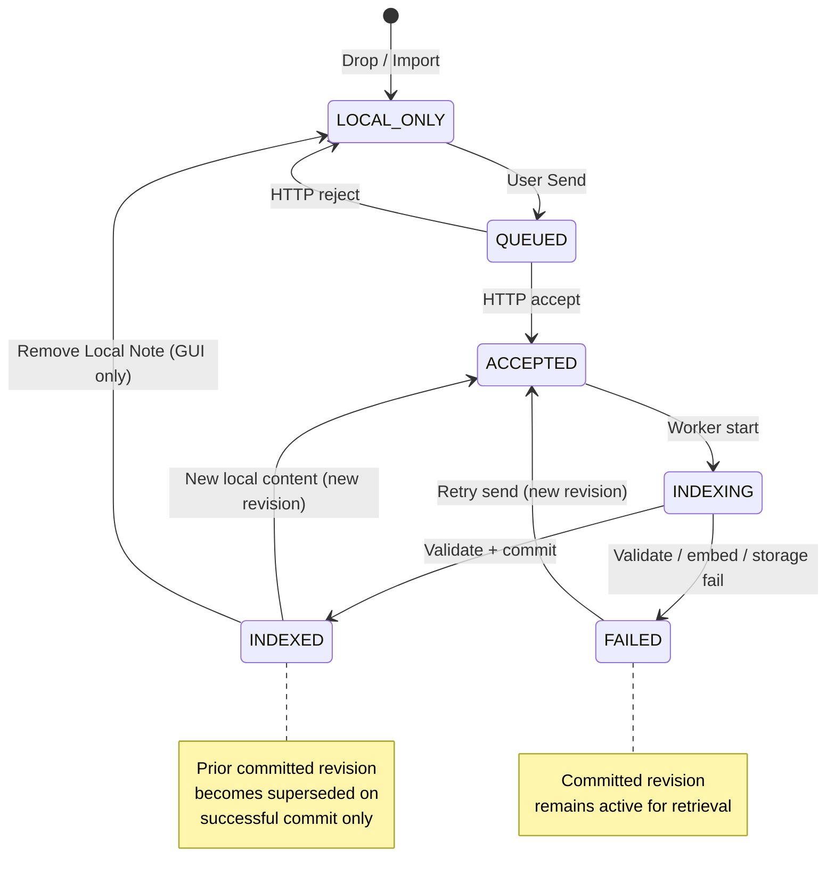

# Thoth Attachment Lifecycle Protocol

**Document type:** Architecture protocol (GUI ↔ Engine attachment lifecycle)  
**Status:** **ALP1** 🔒 **LOCKED** **2026-07-26** — normative lifecycle + P0 decisions. Lock-time text required plan approval before code. **Later outcome:** ALP-A–F implemented 2026-07-26. **ALP-G G3** sealed **2026-09-27** against `e5d5e24` (see § ALP-G G3 Certification Record). **G2b — SUPERSEDED/CLOSED** **2026-09-27** (see § ALP-G G2b Superseded Closeout). The 2026-09-13 owner deferral stands as history: the obsolete manual procedure was not executed and is not a pass. Full ALP1 certification remains unsigned.  
**Created:** 2026-07-26  
**Prerequisite:** [`attachment_state_analysis.md`](attachment_state_analysis.md) ✅  
**Implementation plan:** [`ATTACHMENT_LIFECYCLE_ALP1_IMPLEMENTATION_PLAN.md`](ATTACHMENT_LIFECYCLE_ALP1_IMPLEMENTATION_PLAN.md) 🔒 implemented A–F; G harness only  
**Related:** [`THOTH_AGENT_CONTEXT_BOUNDARY_PROTOCOL.md`](THOTH_AGENT_CONTEXT_BOUNDARY_PROTOCOL.md) (TCB2–TCB4 · **TCB-ALP amendment** §1.5) · [`GUI_integration.md`](GUI_integration.md) (Phases 8–10) · [`GUI_RESTORATION_PROTOCOL.md`](GUI_RESTORATION_PROTOCOL.md) · [`AGENTS.md`](../AGENTS.md)

---

## Purpose

Define the **intended behavior and ownership model** for attachments between the Thoth GUI and Engine.

This protocol resolves the architectural ambiguity documented in [`attachment_state_analysis.md`](attachment_state_analysis.md):

- fragmented sources of truth
- session-as-owner document model causing suffix duplicates
- destructive re-indexing
- GUI-only Send picker authority
- non-recoverable failed sends

**This document is the normative source of truth for future attachment implementation work.**

Implementation follows [`ATTACHMENT_LIFECYCLE_ALP1_IMPLEMENTATION_PLAN.md`](ATTACHMENT_LIFECYCLE_ALP1_IMPLEMENTATION_PLAN.md) and requires explicit human approval per `AGENTS.md`. **No code changes are authorized by the protocol alone.**

---

## Phase ALP0 Record 📋

| Field | Value |
|-------|-------|
| Created | **2026-07-26** |
| Kind | Attachment Lifecycle — analyze + draft normative model |
| Status | **Superseded by ALP1 🔒** |

---

## Phase ALP1 Lock Record 🔒

| Field | Value |
|-------|-------|
| Locked | **2026-07-26** |
| Kind | **Attachment Lifecycle** — identity, namespaces, send/replace/delete, transactional indexing, migration, reconciliation |
| Normative | §1–§10 · **INV-1–INV-16** · **TCB-ALP amendment** (§1.5) · **ALP1 P0 decisions** (§ALP1 P0) |
| Input | [`attachment_state_analysis.md`](attachment_state_analysis.md) · ALP0 draft · ALP1 lock review |
| Supersedes | Ad-hoc attachment behavior · TCB3 path-key registry as **document identity** · suffix collision naming (`_1`, `_2`) for operator attachments |
| Bundled amendment | **TCB-ALP** — session **link** retrieval filter; chunk `document_id`; re-baseline **TCB-X4** |
| Out of scope (ALP1) | Code · HTTP schema implementation · migration scripts · GUI widgets |
| Post-lock rule | Do not revise locked sections without **new ALP lock**; numeric thresholds live in implementation plan |
| Next | **Implementation plan review** → `AGENTS.md` approval → implement |

---

## Relationship to TCB

[`THOTH_AGENT_CONTEXT_BOUNDARY_PROTOCOL.md`](THOTH_AGENT_CONTEXT_BOUNDARY_PROTOCOL.md) locked **retrieval scope** (TCB2), **ingest bind** (TCB3), and **GUI session_id wiring** (TCB4).

This protocol **does not** reopen TCB2 retrieval filter mechanics. It **does** replace the attachment **identity and lifecycle** model assumed by TCB3 §5.3:

| TCB3 (current) | ALP (intended) |
|----------------|----------------|
| Registry: storage path → `owner_context_id` (session owns path) | Registry: **`document_id` → canonical document record** + session **links** |
| Duplicate basename → suffix file (`_1`, `_2`) | Duplicate basename → **same `document_id`**, new **revision** |
| Session owns attachment file | Session **records upload/link event**; document is **workspace-canonical** |

**TCB-ALP amendment 🔒 (ALP1):** Locked with ALP1. TCB3 §5.3 path→owner registry is **superseded** by ALP document registry + session links. TCB-X4 must be re-baselined per implementation plan.

---

# ALP1 P0 Decisions 🔒

Locked **2026-07-26**. All implementation MUST conform.

## Session links 🔒

| Rule | Decision |
|------|----------|
| **Remove Local Note (X)** | Removes **GUI reference** (`ragFilePaths`, local cache binding for that host path) **and** the **session↔document link** for the active chat (`POST /v1/rag/session-links/remove`). |
| **Engine document** | Unchanged — registry row, revisions, storage, chunks persist. |
| **Session links** | **Removed** for the active session when Local Note X is pressed (operator intent: stop retrieving this doc in this chat). Other sessions' links are untouched. |
| **Semantics** | Session links are **retrieval context metadata**, not document ownership. Re-adding the Local Note + Send restores the link (`link_only` / confirm). |

## Document identity 🔒

| Rule | Decision |
|------|----------|
| **Assignment** | `document_id` generated by **Engine** at first **ACCEPTED** state (HTTP accept creating or resolving a document). |
| **Format** | **`document_id` is a UUID** (RFC 4122 string, lowercase hex with hyphens). |
| **Forbidden derivations** | `document_id` MUST NOT be derived from filename, path, `session_id`, or content hash. |
| **Revisions** | **`revision_id`** is a separate UUID per ingest attempt; revision identity is independent of `document_id` assignment rules above. |
| **Reuse** | Subsequent sends for same `canonical_name` **reuse** the existing `document_id`. |

## Physical storage namespaces 🔒

System/seed and operator documents MUST NOT share collision space. Same basename in **different namespaces** is valid.

| Namespace | Purpose | Root path (under agent workspace) |
|-----------|---------|-----------------------------------|
| **System seed corpus** | Plan L benchmark / TCB `benchmark` + `system_reference` tiers | `rag/seed/` |
| **Operator attachment corpus** | Canonical committed operator documents | `rag/attachments/` |
| **Revision storage** | Staging bytes, candidate index artifacts, non-committed revisions | `rag/revisions/{document_id}/{revision_id}/` |

| Rule | Decision |
|------|----------|
| **Committed operator file** | `{rag/attachments}/{canonical_name}` — no `_1` suffix |
| **Seed vs operator** | `rag/seed/GRAG.md` and `rag/attachments/GRAG.md` may coexist — different namespaces, different registry/tier |
| **Inventory scan** | Operator inventory lists **operator attachment registry** only; seed tier listed separately per TCB |

## Migration winner rules 🔒

Deterministic legacy migration (§8.5):

1. **Compare content hashes** (SHA-256 of file bytes) across candidate legacy records/files.
2. **Same hash** → **merge** duplicate records into one `document_id`; union session links.
3. **Different hash** → **newest valid revision** becomes migration winner (committed index preferred; else newest `mtime` on disk; tie-break: largest chunk count).
4. **Losing copies** → preserved as **archived migration artifacts** under `rag/migration_archive/{migration_run_id}/` — not active registry rows.
5. **No destructive deletion** during migration without explicit post-migration cleanup (admin).

## Concurrent revision policy 🔒

| Rule | Decision |
|------|----------|
| **In-flight limit** | At most **one** non-terminal revision (`pending` \| `indexing`) per `document_id`. |
| **Concurrent update** | Second accept while in-flight → **HTTP 409 Conflict** (`revision_in_flight`). |
| **Queueing** | **Forbidden** — no implicit queue. |

## Conflict UX 🔒

| Mode | Behavior |
|------|----------|
| **Normal Send** | Follows revision decision tree (§4.2): hash primary, mtime secondary; conflict when local mtime ≤ committed and hash differs → **confirm dialog** before POST with `force_replace: true`. |
| **Force Replace** | Explicit operator intent (`force_replace: true` on POST, or confirmed dialog). Bypasses conflict confirmation only — **still** requires transactional **candidate → validate → commit**. |
| **Force Replace safety** | MUST NOT delete or swap active committed index/storage until candidate validates and commit succeeds (**INV-1**, **INV-8**, **INV-16**). |

---

# 1. Attachment Identity

## 1.1 Primary identity: `document_id`

A attachment **document** is uniquely identified by **`document_id`**: an Engine-assigned, **stable, opaque identifier** that persists across revisions, re-index events, and chat sessions.

**`document_id` is the only authoritative primary key for an attachment document.**

It is **not**:

- a host filesystem path
- a raw filename string alone
- a chat `session_id`
- a content hash (hashes describe **revisions**, not document identity)

### Canonical name (identity input)

Each `document_id` is bound to exactly one **`canonical_name`** within the **operator attachment namespace**:

- `canonical_name` = sanitized single-segment filename (same rules as `CorpusCreate::sanitizeSuggestedFilename`)
- Examples: `EGAR.md`, `COGNATE_V2.md`
- **Unique constraint:** at most one `document_id` per `canonical_name` in the operator attachment tier

**Why not filename alone?** Filenames are human-facing keys, not stable records. **`document_id` + `canonical_name`** separates operator intent (“this logical document slot”) from storage and revision history.

**Why not path?** Host paths and even Engine storage paths change (sandbox migration, container layout). Paths are **locators**, not identity.

**Why not content hash?** Same document can have many revisions; hash equality means “same revision content,” not “same document over time.”

**Why not session-scoped ID?** Chat sessions are **upload context**, not document ownership. Session-scoped identity caused `EGAR.md` / `EGAR_1.md` duplicates (see analysis §Conclusion).

**Why not project/global UUID without canonical name?** Operators reason about `EGAR.md` as a **canonical slot**. The protocol binds UUID identity to that slot for deduplication and replace semantics.

### `document_id` assignment 🔒

| Event | Rule |
|-------|------|
| First **ACCEPTED** for a `canonical_name` with no existing document | Engine generates new **`document_id` (UUID)** |
| Subsequent sends for same `canonical_name` | **Reuse existing `document_id`** — never allocate a new UUID for suffix collision |
| **`revision_id`** | New **UUID** per accept / ingest attempt |

**Forbidden:** deriving `document_id` from `canonical_name`, storage path, `session_id`, or `content_hash`.

---

## 1.2 Document identity vs document revision

A document has **stable identity** and **mutable revisions**.

### Stable identity (document record)

| Field | Owner | Purpose |
|-------|-------|---------|
| `document_id` | Engine | Primary key |
| `canonical_name` | Engine | Human logical key; unique in attachment tier |
| `created_at` | Engine | First accept timestamp |
| `current_revision_id` | Engine | Pointer to active indexed revision (null if never indexed) |
| `storage_path` | Engine | **`rag/attachments/{canonical_name}`** — operator namespace; no `_1` suffix |

### Revision metadata (revision record)

Each ingest attempt creates a **revision** row:

| Field | Purpose |
|-------|---------|
| `revision_id` | Unique **UUID** per ingest attempt |
| `revision_number` | Monotonic per `document_id` (1, 2, 3, …) |
| `content_hash` | Cryptographic hash of accepted bytes (SHA-256) |
| `local_source_mtime` | Host file mtime at send time (optional, GUI-supplied) |
| `local_source_path` | Host path at send time (audit only) |
| `accepted_at` | Engine accept timestamp |
| `indexed_at` | When revision became active (null until commit) |
| `chunk_count` | After successful index commit |
| `state` | `pending` · `indexing` · `committed` · `failed` · `superseded` |
| `failure_reason` | When `failed` |

### Example

```
Document:
  document_id: 550e8400-e29b-41d4-a716-446655440000
  canonical_name: EGAR.md
  current_revision_id: 6ba7b810-9dad-11d1-80b4-00c04fd430c8

Revision 1 (superseded):
  content_hash: abc123…
  accepted_at: 2026-07-25T10:30:00Z
  chunk_count: 95
  state: superseded

Revision 2 (failed):
  content_hash: def456…
  accepted_at: 2026-07-26T08:15:00Z
  chunk_count: 0
  state: failed
  failure_reason: embedding_unavailable

Revision 3 (committed — current):
  content_hash: fed789…
  accepted_at: 2026-07-26T09:00:00Z
  chunk_count: 101
  state: committed
```

Engine retrieval and corpus inventory refer to **the committed revision** for `document_id`.

---

## 1.3 Identity behavior matrix

| Scenario | Identity outcome |
|----------|------------------|
| **Same file sent twice** (same path, same bytes) | Same `document_id`. If `content_hash` matches **committed** revision → **no-op** (ignore duplicate send). If matches pending revision → idempotent accept. |
| **Same filename from another chat session** | Same `canonical_name` → **same `document_id`**. Session B creates a **session link** (§1.4). Apply revision decision tree (§4). **Never** create `EGAR_1.md`. |
| **Renamed file** (host path or basename change) | Treated as **new local source** for send decision. If basename changes to new `canonical_name` → **new `document_id`**. If GUI rename-in-place updates slot only → still same host binding; send uses basename for canonical key. |
| **Modified file contents** (same basename) | Same `document_id`. New revision if decision tree (§4) says local content is newer/different. Replace **only after successful index commit**. |

---

## 1.4 Session association (metadata, not ownership) 🔒

Chat **`session_id`** records **which sessions have linked or uploaded** a document. It does **not** define document identity or ownership.

| Object | Cardinality |
|--------|-------------|
| `document_id` | 1 canonical document |
| `session_id` link | Many sessions may link to same `document_id` |
| Upload event | `(session_id, document_id, revision_id, local_source_path, timestamp)` |

**Remove Local Note (X):** removes GUI slot **and** the **session↔document link** for the active chat (ALP amend 2026-09-10). Engine document/storage/chunks remain. Re-add + Send restores the link.

**Retrieval (TCB-ALP amendment — §1.5):** A chunk is visible in session **S** default scope iff:

1. chunk `corpus_tier` = `session_attachment`, **and**
2. chunk’s `document_id` has an **active session link** to **`active_context_key` = S**.

Link is created automatically on successful Send (including no-op hash match) from session **S**.

**Operator workflow (clarified):** *“EGAR.md represents the current canonical document, regardless of chat tab”* applies to **storage and inventory** (one row, one storage path, one revision chain). It does **not** mean every chat tab retrieves EGAR automatically. Retrieval remains **session-linked** per **TCB-I1 / TCB-L2** unless a future shared-knowledge feature is locked.

---

## 1.5 Namespace and tier boundaries 🔒

Three **physical storage namespaces** (ALP1 P0). Same basename across namespaces is **valid**.

| Namespace | Path | `corpus_tier` | Registry |
|-----------|------|---------------|----------|
| **System seed corpus** | `rag/seed/**` | `benchmark`, `system_reference` | Tier classification only (TCB P2) |
| **Operator attachment corpus** | `rag/attachments/{canonical_name}` | `session_attachment` | ALP document registry |
| **Revision storage** | `rag/revisions/{document_id}/{revision_id}/` | n/a (not retrievable until commit) | Revision record only |

| Boundary | Rule |
|----------|------|
| **Uniqueness scope** | `canonical_name` unique in **operator attachment registry** only |
| **Seed vs operator** | `rag/seed/GRAG.md` ≠ `rag/attachments/GRAG.md` — separate namespaces, no collision |
| **Canonical name normalization** | Case-sensitive: `EGAR.md` ≠ `egar.md` |
| **Legacy Phase 8 ids** | `stableDocumentId(storage_key)` retired for operator tier; migration maps old → UUID (§8.5) |

### TCB-ALP retrieval amendment 🔒

ALP amends TCB3 chunk binding **filter input**, not TCB2 scorer or tier enum:

| TCB3 (current) | TCB-ALP (intended) |
|----------------|-------------------|
| Filter: `chunk.owner_context_id == active_context_key` | Filter: `chunk.document_id` has **session link** to `active_context_key` |
| Registry: path → `owner_context_id` | Registry: `document_id` record + **`session_links(session_id, document_id)`** |
| One owner per path | Many sessions may link one `document_id`; chunks carry **`document_id`** + tier |

**TCB-X4 re-baseline:** Ingest with `session_id = S` → link created → retrieval for `active_context_key = S` includes document; for `T ≠ S` excludes unless **T** also has link.

**Preserved:** TCB-R1–R4, TCB-I1, TCB-L2, TCB-O*, tier exclusions for benchmark/system_reference.

---

# 2. Source of Truth

| Concern | Authoritative owner | Role |
|---------|---------------------|------|
| **Document registry** (identity + revisions + session links) | **Engine** (`document_registry` — durable store) | Single source of truth for attachment lifecycle |
| **Chunk index** (`rag_index.bin`, in-memory chunks) | **Engine** | Indexed content for committed revision only |
| **Retrieval metadata** (`corpus_tier`, scope linkage) | **Engine** (derived at index + query from registry) | Derived from registry + TCB scope rules |
| **Corpus inventory API** | **Engine** (derived view) | Read model over registry + index state |
| **Local Notes slot list** (host paths, max 4) | **GUI** | Operator workspace UI; not authoritative for Engine |
| **Send picker eligibility** | **Engine query + GUI local file metadata** | Engine decides; GUI supplies hash/mtime/path |
| **GUI `local_note_engine` cache** | **GUI** (non-authoritative) | Display cache keyed by host path; reconciled from Engine |

### Classification

| System | Classification |
|--------|----------------|
| Engine document registry | **Authoritative** |
| Engine chunk index | **Authoritative** (for committed revision content) |
| Corpus inventory JSON | **Derived view** |
| Retrieval chunk classification | **Derived view** |
| GUI `chat_sessions.json` → `rag_files` | **Authoritative** (Local Notes slots only) |
| GUI `local_note_engine` | **Cached** (must reconcile) |
| Send picker candidate set | **Derived** (computed per open from Engine + local) |
| Corpus panel display text | **Cached** (last refresh) |

**Rule:** If GUI cache disagrees with Engine registry, **Engine wins** after reconciliation (§8).

---

# 3. Send Behavior

## 3.1 Lifecycle states (normative)

| State | Meaning | Authoritative store |
|-------|---------|---------------------|
| **LOCAL_ONLY** | Host path in Local Notes; no Engine document link | GUI slot list |
| **QUEUED** | GUI/backend posted ingest; awaiting HTTP accept | Client transient (optional) |
| **ACCEPTED** | Engine persisted bytes + created revision in `pending` | Engine registry |
| **INDEXING** | Worker building candidate index for revision | Engine registry + worker |
| **INDEXED** | Revision **committed**; active for retrieval | Engine registry + index |
| **FAILED** | Revision terminal failure; **prior committed revision unchanged** | Engine registry |

**Note:** `ACCEPTED` and `INDEXING` may both display as “indexing…” in GUI. Distinction matters for Engine logic, not operator copy.

## 3.2 Send to Engine — normative sequence

1. GUI collects local file metadata: path, basename → `canonical_name`, **content_hash**, **mtime**.
2. GUI calls Engine ingest with:
   - `canonical_name`, `content`, `content_hash`, `local_source_mtime`, `session_id`
   - optional `force_replace: true` (Force Replace — ALP1 P0)
   - optional `dry_run: true` (intent-only — implementation plan)
3. Engine runs **revision decision tree** (§4) → accept | no-op | conflict.
4. On accept: assign or reuse **`document_id`**, create **`revision_id`**, write staging file, state → **ACCEPTED**.
5. Async worker: state → **INDEXING**; build **candidate index** (§6).
6. On commit success: state → **INDEXED** (revision `committed`); prior revision → `superseded`.
7. On failure: state → **FAILED** for revision; **`current_revision_id` unchanged**.

## 3.3 Assignment and “sent” semantics

| Question | Answer |
|----------|--------|
| **When is `document_id` assigned?** | At **HTTP accept** when Engine creates or resolves the canonical document (step 4). |
| **When is a document considered “sent”?** | **Operator “sent”** = accept succeeded (`document_id` known). **Operator “ready for retrieval”** = **INDEXED** (committed revision). GUI must distinguish in labels. |
| **When does it disappear from the picker?** | When Engine reports **no send action required**: committed revision matches local `content_hash`, OR revision is **INDEXING/ACCEPTED** for same hash (in flight). See §7. |
| **Can a failed document be sent again?** | **Yes.** Failed revision does not block retry. Picker shows **Retry** when last revision `failed` or local hash differs from committed. |
| **Can an indexed document be replaced?** | **Yes**, when local content differs and revision decision tree approves (§4). Replacement is **commit-after-success** only. |

## 3.4 GUI obligations on Send

- Must pass **content_hash** and **local_source_mtime** on every send.
- Must not treat empty `document_id` in local cache as authoritative without reconciliation.
- Must refresh document state from Engine after accept and after terminal INDEXING/FAILED events.

---

# 4. Resend / Replace Policy

## 4.1 Product goal

> **One canonical operator document per `canonical_name`.**  
> `EGAR.md` always refers to the current committed revision of `document_id` for `EGAR.md`, independent of chat tab.

Session **A** and session **B** sending `EGAR.md` interact with the **same `document_id`**.

## 4.2 Revision decision tree (normative)

Apply on every Send:

```
Same canonical_name exists in registry?
        |
       no --> CREATE document + revision 1 --> ACCEPT --> INDEX
        |
       yes
        |
Same content_hash as CURRENT COMMITTED revision?
        |
       yes --> NO-OP (200 idempotent; link session if not linked)
        |
       no
        |
Same content_hash as IN-FLIGHT revision (accepted/indexing)?
        |
       yes --> NO-OP (duplicate send while indexing)
        |
       no
        |
Compare local vs committed using content_hash (primary) and mtime (secondary):
        |
Local hash == committed hash --> NO-OP
        |
Local hash != committed hash
        |
        +-- local_source_mtime > committed indexed_at (or local hash proves change)
        |       --> CREATE new revision (pending) --> INDEX --> COMMIT on success
        |
        +-- local_source_mtime <= committed AND hash differs
                --> CONFLICT (409 unless force_replace)
                --> GUI: Confirm dialog; POST with force_replace: true to proceed
```

**Normal Send:** follows tree above. **Force Replace:** `force_replace: true` skips confirmation but **never** skips transactional commit (§6, **INV-16**).

**Timestamp alone is insufficient.** A newer mtime with **same hash** is a no-op. A newer mtime with **different hash** triggers replacement flow when approved. An older mtime with different hash → **conflict** unless Force Replace.

## 4.3 Same session vs different session

| Case | Policy |
|------|--------|
| **Same session resend** (newer content) | New revision → replace on successful commit. Same `document_id`. |
| **Same session resend** (same content) | No-op. |
| **Different session resend** (newer content) | **Same as same session.** No suffix duplicate. Create session link for requesting session. |
| **Different session resend** (same content) | No-op + session link if missing. |
| **Conflict (older/dubious local)** | **409** + confirm dialog; **Force Replace** via `force_replace: true` on POST |

## 4.4 Forbidden behaviors

- **Forbidden:** Allocating `canonical_name_1.ext` for operator attachment tier collision.
- **Forbidden:** Allocating new `document_id` for same `canonical_name` while prior document exists.
- **Forbidden:** Replacing committed index before candidate index validates (§6).

---

# 5. Delete Behavior

## 5.1 Two distinct operator actions

| Action | Scope | Normative effect |
|--------|-------|------------------|
| **Remove Local Note** (X on slot) | GUI + Engine session link | Remove GUI slot/cache **and** unlink `(session_id, document_id)` via `POST /v1/rag/session-links/remove` |
| **Remove from Engine** (future explicit command) | Engine document | Evict document from registry + index + storage |

## 5.2 Remove Local Note (default X button)

| Layer | Effect |
|-------|--------|
| GUI `ragFilePaths` | Remove host path slot |
| GUI `local_note_engine` cache | Remove binding for that path |
| Engine document registry | **Unchanged** (document/revision rows) |
| Engine chunks / files | **Unchanged** |
| Session link | **Removed** for the active `session_id` 🔒 (ALP amend 2026-09-10) |
| Send to Engine | Re-enabled after re-add: dry_run → `link_only` (or picker allows `no_op` confirm) |

**Rationale:** X means “stop using this attachment in **this** chat.” Accidental X must not destroy indexed knowledge for other sessions; it must reset Send eligibility and retrieval for the current session.

## 5.3 Remove from Engine (explicit, deferred UI)

When implemented:

| Layer | Effect |
|-------|--------|
| Document registry | Mark `document_id` **evicted** (soft) or delete (admin) |
| Session links | Remove all links |
| Chunk index | Remove chunks for committed revision |
| Storage file | Delete `rag/attachments/{canonical_name}` after index removal |
| GUI cache | Reconcile → LOCAL_ONLY if slot still has file; else empty |

**History:** Soft-evict retains audit row (revision history). Hard delete requires admin/cleanup (§8).

## 5.4 What delete does **not** mean

- Delete Local Note ≠ delete corpus entry
- Delete Local Note ≠ remove retrieval availability for linked sessions
- Delete chat session ≠ delete documents uploaded from that session (links may remain until cleanup)

---

# 6. Transactional Indexing

## 6.1 Required guarantee (normative)

> **A failed re-index must never destroy a known-good committed index.**

Current **`delete → rebuild`** path is **non-compliant** and must be replaced.

## 6.2 Required state transition

```
CURRENT (non-compliant):
  removeChunksForFile(live) → embed → partial fail → saveIndex(degraded)

REQUIRED:
  build candidate chunks (in memory or staging partition)
        → validate candidate (min chunk count, embed success threshold)
        → commit replacement (atomic swap)
        → on any failure: discard candidate, live revision unchanged
```

## 6.3 Commit phases

| Phase | Action |
|-------|--------|
| **Stage** | Write bytes under **`rag/revisions/{document_id}/{revision_id}/`** |
| **Build** | Generate candidate chunks + embeddings referencing staging path or revision id |
| **Validate** | `candidate_chunk_count >= policy minimum` AND embed failure rate ≤ threshold AND storage writable |
| **Commit** | Atomically: swap chunk set for `document_id` / storage path; update `current_revision_id`; mark old revision `superseded`; persist index |
| **Abort** | Delete candidate artifacts; mark revision `failed` with reason; **restore** live index if any swap started (single-writer lock) |

## 6.4 Failure handling

| Failure | Revision state | Live index |
|---------|----------------|------------|
| **Embedding failure** (HTTP 500, partial batch) | `failed` | **Unchanged** (prior committed) |
| **Chunking failure** (zero valid chunks) | `failed` | **Unchanged** |
| **Storage failure** (cannot write index) | `failed` | **Unchanged** |
| **Timeout** (worker exceeded limit) | `failed` | **Unchanged** |
| **Validate fail** (below min chunks) | `failed` | **Unchanged** |
| **Worker crash mid-commit** | `failed` or `repair_required` | **Restore from last persisted committed revision**; never leave partial swap |
| **Accept OK, worker never starts** | revision stays `pending`; document **`indexing`** | Prior committed unchanged; reconciliation may mark **`stale_pending`** |
| **Concurrent in-flight revisions** | **HTTP 409 Conflict** (`revision_in_flight`) — no queue (**INV-11**, ALP1 P0) |

## 6.5 Observability

- `INDEXING_COMPLETED` must report `revision_id`, `success`, `chunk_count`, `failure_reason`.
- Corpus list `status: failed` applies to **revision**, not document: document with committed rev **N** and failed rev **N+1** still shows **indexed** with rev **N** chunk count until **N+1** commits.

---

# 7. Picker Authority

## 7.1 Principle

> **“Should this file appear in the Send picker?”** is answered by **Engine policy using Engine registry state**, with **GUI-supplied local metadata** (hash, mtime, path).  
> **GUI-only `document_id` cache is not sufficient.**

## 7.2 Recommended API (normative intent)

Before showing picker, GUI calls Engine:

**`POST /v1/rag/documents/intent`** (or equivalent batch) with per Local Note:

```json
{
  "session_id": "…",
  "candidates": [
    {
      "local_source_path": "/host/EGAR.md",
      "canonical_name": "EGAR.md",
      "content_hash": "sha256:…",
      "local_source_mtime": "2026-07-26T08:30:00Z"
    }
  ]
}
```

Engine returns per candidate:

```json
{
  "action": "send" | "no_op" | "retry" | "conflict",
  "document_id": "doc-…",
  "reason": "…"
}
```

Picker lists only candidates where `action ∈ { send, retry, conflict }`.

## 7.3 Picker rules (normative)

| Local / Engine condition | Appears in picker? | Label |
|--------------------------|-------------------|-------|
| **Never sent** (no registry row) | **Yes** | Send |
| **Same hash as committed** | **No** | (slot shows indexed status) |
| **Pending / indexing** (in-flight revision, same hash) | **No** | Indexing… |
| **Pending / indexing** (in-flight, **different** hash than local) | **No** until terminal | Indexing… (block parallel replace) |
| **Indexed, local hash newer** | **Yes** | Update available |
| **Failed last revision** | **Yes** | Retry indexing |
| **Conflict** (older mtime, different hash) | **Yes** | Replace (confirm) |
| **Deleted Local Note** | **No** (not in slot list) | — |
| **Stale GUI cache** | Resolved by intent API | — |

## 7.4 Single vs multi picker

- If exactly one eligible candidate → auto-select (current UX preserved).
- If multiple → choice dialog shows **canonical_name** + **action** (Send / Retry / Replace).

---

# 8. Inventory and Reconciliation

## 8.1 Corpus inventory (derived view)

**`GET /v1/rag/corpus`** returns **one row per `document_id`** in operator attachment tier (not one row per suffix file, not raw filesystem scan without registry join).

| Field | Source |
|-------|--------|
| `id` | `document_id` |
| `name` | `canonical_name` |
| `status` | Derived from **current committed revision**, or `indexing` if in-flight, or `failed` if no committed and last failed |
| `chunk_count` | Committed revision only |
| `revision_number` | Optional display |

Seed/benchmark tiers may appear as separate sections (TCB tiers unchanged).

## 8.2 Reconciliation triggers

| Event | Action |
|-------|--------|
| **GUI startup** | For each Local Note slot: `GET document by canonical_name` or batch reconcile; refresh cache |
| **Engine restart** | Registry reload from durable store; rebuild in-memory index from disk; **failure states from durable registry** (not ephemeral map) |
| **Container rebuild** (empty Engine) | GUI caches show stale → reconcile marks slots **send** or **orphan** |
| **Failed ingest** | Registry revision `failed`; GUI sync via events + corpus |
| **Deleted Local Note** | No Engine action; links remain |
| **Stale registry** (storage file missing) | Reconciliation marks document **repair_required**; admin cleanup |

## 8.3 Reconciliation API (normative intent)

**`POST /v1/rag/documents/reconcile`**

- Input: GUI session id + list of `(local_source_path, canonical_name, content_hash, mtime)`
- Output: authoritative binding for each slot + recommended action
- Side effect: optional session link repair

## 8.4 Admin cleanup (deferred)

**`POST /v1/rag/admin/purge-orphans`** (admin only):

- Remove storage files with no registry row
- Remove registry rows with no storage and no committed revision past retention
- Dedupe legacy suffix files (`*_1.md`) into canonical document where content hash matches

Operator-visible **Repair inventory** may call reconcile + purge in controlled maintenance window.

## 8.5 Legacy migration (current corpus → ALP) 🔒

Migration is **required** before ALP behavior is enabled in production.

### Winner selection (deterministic)

1. Compute **SHA-256** content hash for each legacy file / record candidate.
2. **Same hash** → merge into one `document_id`; union session links; single canonical `rag/attachments/{canonical_name}`.
3. **Different hash** → select **newest valid revision** as winner:
   - Prefer row/file with **committed index** (chunk count > 0);
   - Else newest filesystem **mtime**;
   - Tie-break: **largest chunk count**.
4. **Non-winning copies** → move/copy to **`rag/migration_archive/{migration_run_id}/`** as read-only artifacts (registry metadata preserved in migration log).
5. **No destructive deletion** during migration — explicit admin cleanup only after verification.

### Migration steps

| Step | Source (current) | Target (ALP) | Rule |
|------|------------------|----------------|------|
| **M0** | Pre-migration snapshot | Backup | `rag/`, `rag_index.bin`, `rag_attachment_registry.json`, `chat_sessions.json` |
| **M1** | Suffix files (`EGAR_1.md`, …) in legacy flat `rag/` | One document per stem | Apply winner rules; relocate losers to migration archive |
| **M2** | `rag_attachment_registry.json` (path → session_id) | UUID `document_id` + session links | Collapse by `canonical_name` + hash merge |
| **M3** | Phase 8 `stableDocumentId(storage_key)` | UUID `document_id` | Emit **`legacy_id_map.json`** for GUI reconcile |
| **M4** | Chunks keyed by legacy absolute path | Chunks tagged with UUID `document_id` | Reclassify tiers; paths under `rag/attachments/`; **no re-embed** if hash unchanged |
| **M5** | Relocate seed files | `rag/seed/**` | Preserve benchmark/system_reference tiers (TCB P2) |
| **M6** | GUI `local_note_engine` | Reconciled cache | Startup reconcile before Send enabled |
| **M7** | Degraded indexes | Repair reindex | Transactional path from committed bytes in `rag/attachments/` |
| **M8** | `legacy_orphan` | Link or archive | Bind when session known; else orphan tier until admin |

**Migration invariants:**

- **M-INV-1:** Active operator attachments live only under `rag/attachments/` post-M1 (no suffix names in active registry).
- **M-INV-2:** Every committed chunk belongs to exactly one UUID `document_id`.
- **M-INV-3:** GUI reconciliation completes before Send picker enabled post-upgrade.
- **M-INV-4:** Migration archive retained until explicit admin purge.

---

# 9. Lifecycle State Machine

## 9.1 Document + revision states



## 9.2 ASCII transition table

| From | Event | To | Side effects |
|------|-------|-----|--------------|
| LOCAL_ONLY | Send (new doc) | ACCEPTED | Create `document_id`, rev 1, session link |
| LOCAL_ONLY | Send (no-op hash) | INDEXED* | *Already indexed elsewhere; sync GUI |
| ACCEPTED | Worker start | INDEXING | — |
| INDEXING | Commit OK | INDEXED | Swap index; supersede old rev |
| INDEXING | Commit fail | FAILED | Discard candidate |
| FAILED | Retry | ACCEPTED | New revision_number |
| INDEXED | Send (new hash) | ACCEPTED | New revision; old stays live until commit |
| INDEXED | Remove Local Note | LOCAL_ONLY (GUI) | Engine unchanged |
| any | Remove from Engine | evicted | Index + file removed |

## 9.3 Recovery paths

| Situation | Recovery |
|-----------|----------|
| Failed revision | **Retry** from picker → new revision |
| Degraded legacy index | One-time **reindex committed revision** from storage bytes (admin/repair) |
| GUI stale after rebuild | **Reconcile** on startup |
| Legacy suffix files | **Admin dedupe** → canonical `document_id` |

## 9.4 Failure and edge transitions (complete)

| From | Event | To | Notes |
|------|-------|-----|-------|
| QUEUED | HTTP 4xx/5xx | LOCAL_ONLY | No registry row; GUI shows error |
| ACCEPTED | Worker never runs (crash) | ACCEPTED/`pending` + **`stale_pending`** | Reconcile or retry |
| INDEXING | Worker crash mid-build | FAILED | Candidate discarded |
| INDEXING | Worker crash mid-commit | FAILED + **repair_required** | Restore last committed from disk/index snapshot |
| INDEXING | Second concurrent accept | **409 Conflict** | **INV-11** — no queue |
| FAILED | No prior committed revision | Document **`failed`**, not retrievable | TCB-R3: no grounding until retry succeeds |
| FAILED | Prior committed exists | Document **`indexed`** (old rev) + last rev **`failed`** | Retrieval uses committed rev **N** |
| INDEXED | Engine Remove / evict | **`evicted`** | Chunks removed; links cleared |
| any | Session deleted (chat) | Links for that session **removed** | Document persists if other links or no evict |
| LOCAL_ONLY | Reconcile finds Engine row | Sync to INDEXED/FAILED | Cache refresh only |

---

# 10. Protocol Invariants

The following are **non-negotiable** under ALP1 🔒:

**INV-1 — Index safety**  
A successful committed index must never be silently degraded or deleted by a failed re-index attempt.

**INV-2 — Canonical uniqueness**  
The operator attachment tier must not silently create duplicate corpus entries for the same `canonical_name`. Suffix filenames (`_1`, `_2`) are forbidden for operator attachments.

**INV-3 — Stable identity**  
`document_id` (UUID) for a `canonical_name` is stable for the lifetime of the document. Revisions change; identity does not.

**INV-4 — Picker truth**  
Send picker eligibility must not rely on GUI-only `document_id` cache without Engine confirmation.

**INV-5 — Inventory accuracy**  
Engine inventory represents **actual Engine registry + committed index state**, not a raw filesystem listing divergent from registry.

**INV-6 — Recoverability**  
Failed indexing leaves the document in a **recoverable** state: prior revision retrievable; retry permitted.

**INV-7 — Content-hash idempotence**  
Sending identical content twice is a no-op (aside from session link creation).

**INV-8 — Replace on commit**  
Content replacement activates only after **successful validate + commit**, never at accept time alone.

**INV-9 — Reconciliation**  
After GUI or Engine restart, Local Note display must converge via reconciliation within one explicit sync pass.

**INV-10 — Session as link**  
`session_id` associates a document with retrieval context; it must not partition storage into competing filenames for the same canonical document. Local Note delete does not remove links.

**INV-11 — Single in-flight revision**  
At most one non-terminal revision per `document_id`; concurrent attempts return **409 Conflict** — no queue.

**INV-12 — Hash algorithm**  
`content_hash` MUST use **SHA-256** over raw accepted bytes; GUI and Engine use the same encoding (hex lowercase, optional `sha256:` prefix).

**INV-13 — Namespace separation**  
Operator attachments (`rag/attachments/`), seed corpus (`rag/seed/`), and revision storage (`rag/revisions/`) MUST NOT share collision space.

**INV-14 — Migration safety**  
ALP indexing path MUST NOT run on operator corpus until migration **M0–M3** completes (or explicit greenfield install flag).

**INV-15 — UUID identity**  
`document_id` and `revision_id` are Engine-generated UUIDs; never derived from filename, path, session, or hash.

**INV-16 — Force Replace safety**  
`force_replace: true` bypasses conflict confirmation only; it MUST NOT bypass transactional candidate → validate → commit or delete active data before successful commit.

---

# Document Revision and Replacement Policy (Summary)

This section consolidates §1.2 and §4 for implementers.

| Concept | Rule |
|---------|------|
| **Identity** | UUID `document_id` + `canonical_name` (not hash-derived) |
| **Revision** | UUID `revision_id`, monotonic `revision_number`, `content_hash` |
| **Equality** | Same hash → no-op |
| **Replacement** | Different hash + approved tree (or Force Replace) → new revision → commit → supersede |
| **Comparison** | **Primary:** `content_hash`. **Secondary:** `local_source_mtime` vs `committed indexed_at`. **Never** mtime alone. |
| **Conflict** | 409 + confirm; **`force_replace: true`** for Force Replace |
| **Session** | Link metadata only; persists after Local Note delete |

---

# Implementation

See **[`ATTACHMENT_LIFECYCLE_ALP1_IMPLEMENTATION_PLAN.md`](ATTACHMENT_LIFECYCLE_ALP1_IMPLEMENTATION_PLAN.md)**. Implementation requires `AGENTS.md` approval.

---

# ALP1 Lock Review (closed)

**Review date:** 2026-07-26  
**Lock date:** **2026-07-26**  
**Verdict:** **ALP1 🔒 LOCKED**

All P0 clarifications resolved in **§ALP1 P0 Decisions**. Former ambiguities A1–A7 closed:

| Item | Resolution |
|------|------------|
| A1 Retrieval vs canonical | Storage/inventory global; retrieval requires session link |
| A2 Seed collision | **`rag/seed/`** vs **`rag/attachments/`** namespaces |
| A3 `document_id` format | **UUID** at first ACCEPTED; migration `legacy_id_map` |
| A4 Concurrent revision | **409 Conflict**; no queue |
| A5 Conflict UX | Confirm dialog + **`force_replace: true`** |
| A6 Inventory status | `indexed` \| `indexing` \| `failed` (no committed row) |
| A7 Session link on delete | **Links persist** |

**TCB-ALP amendment:** Bundled with ALP1 🔒 (§1.5).

---

**STATUS:** ALP1 🔒 locked. Implementation plan published. **STOP.** No code.

**Next step:** Review implementation plan → `AGENTS.md` approval → implement.

---

## ALP-G G3 Certification Record ✅

**Sealed:** 2026-09-27  
**Overall:** **G3 VERIFIED**  
**Scope:** One coherent manual G3 run. This seal does not sign G2b and does not claim full ALP1 certification.

| Field | Value |
|-------|-------|
| Parent | `e5d5e24e877931165593ca67693445d47f824abe` |
| Subject | `fix(gui): place each Local Note X in its own slot` |
| `external/basic_agent` | `a308ef493cb2a1ccdb4c59c898bb068575941803` |
| Isolated Engine | `thoth-g3-engine` `692169b9ac18` on `http://127.0.0.1:8091` |
| Image | `thoth-engine:local` `sha256:98da282ca45485728b55042b3eb1b297da914e9143f8f7c270ee9d08121ad2b4` |
| Volumes | `thoth-g3-workspace`, `thoth-g3-logs` (created 2026-09-27 09:00, empty corpus before the run) |
| Live Engine | Untouched. `thoth-thoth-engine-1` `4dc93c83cdaa` on port 8090 |
| GUI workspace | `/tmp/thoth-g3-gui-e5d5e24-final` |
| Session | `session-1790528962216-c4f8a4c1` |
| GUI PIDs | `74422` (G3-1 through G3-4), `80181` (G3-5 through G3-7) |
| `/ready` before the run | `status=ready`, `llama_cpp`, embedding dimension 768, capabilities included `corpus` and `ingest` |
| G3-1 | **PASS** |
| G3-2 | **PASS** |
| G3-3 | **PASS** |
| G3-4 | **PASS** |
| G3-5 | **PASS** |
| G3-6 | **PASS** |
| G3-7 | **PASS** — X lifecycle, positive retrieval, and negative retrieval |

`G3-3 criterion corrected before this run: single-candidate no_op uses the documented auto-select path; chooser-only label is not required.`

The run started from an empty corpus. Source and tests were not edited during certification. GUI imports, Send, decline, exit, and chat submission were performed by the operator. Native file choosers were not automated.

**G3-1.** With the isolated Engine stopped and PID `74422` still up, import of `/tmp/thoth-g3-local-notes-e5d5e24/g3-cert.md` produced a host-only slot. The corpus line was **Corpus listing unavailable.** The log recorded `listCorpusDocuments failed: Couldn't connect to server`. The saved session held only the host path. Hash `1e3225a4155b698a90367f871ded0b776f760a8e7c9e35900ff490b9f3b84363`. No document id, revision id, or session link. **Send to Engine** stayed disabled.

**G3-2.** The same container `692169b9ac18` restarted. The GUI was not restarted. The corpus line returned to **Corpus is empty.** The note stayed host-only. **Send to Engine** became enabled. Cache `reconcile_verified` was true with empty `document_id` and `revision_id`. Dry-run was `action: create` and did not create a document. There was no `document_registry.json`.

**G3-3 — create.** Document `04b86ca3-42cb-49f4-b2ef-9a075af0c617`. Committed revision `57bbcbca-ff3a-4f6e-b981-ee9f0aa9cf8c`. Hash `1e3225a4155b698a90367f871ded0b776f760a8e7c9e35900ff490b9f3b84363`. `local_source_mtime` `1790529203`. Indexed `2026-09-27T17:16:22Z` (`indexed_at_ms` `1790529382887`). One session link from `session-1790528962216-c4f8a4c1`.

**G3-3 — no_op.** An unchanged Send kept that revision and that single link. One eligible Local Note auto-selected. No chooser appeared.

**G3-3 — new revision.** Later mtime `1790529622`, hash `3e8f38b001bd106a5418aba4ad19b619e87184c17a20cd1db0528f805587ec6e`. Dry-run `action: new_revision`. No new revision was stored. With one Local Note, the chooser label **Update available** was not required.

**G3-3 — conflict.** Earlier mtime `1790529000`, hash `b6053aaadad8859277cc827fbed033c1eb6dcf990974a925812f7837856559ed`. Dry-run `action: conflict`.

**G3-4.** **No** on **Confirm force replace** left the same document, revision, committed hash, local mtime `1790529000`, and one session link. A later dry-run was still `conflict`.

**G3-5.** PID `74422` was closed. PID `80181` reopened the same workspace against the same Engine. The cache still named the same document and revision. The cache hash was the conflict file. Dry-run stayed `conflict`. No extra revision or session link was invented.

**G3-6.** `g3-empty.md` was a 0-byte host-only slot with no document id and no session link. An empty-content request returned HTTP 400, `content must not be empty`. `g3-cert.md` still dry-ran as `conflict`. The corpus stayed one document.

**G3-7 — X lifecycle.** Side document `6fa741e9-ce41-4caf-be83-cca89d590eff`. Revision `d7db566f-b53a-48a7-bc4c-116966bc9813`. Hash `af856b7ea59411487d7a8fa90f6e0a1445b7f865c44255a92e4023d1191edf5b`. Stored at `/workspace/rag/attachments/g3-side.md`. Before the click, the side **X** at `(1913, 763)` sat on the row of `g3-side.md · id=6fa741e9 · 1 chunk` at `(1378, 770)`. The cert **X** was `(1913, 722)`. The empty-note **X** was `(2549, 722)`. Empty Slot 4’s **X** was hidden. **Send to Engine** stayed visible. After the click, the session file and cache no longer contained `g3-side.md`. The only session link was the cert document. The side document, revision, stored file, and corpus entry remained.

**G3-7 — positive retrieval.** Request `req-1790530424803-0`. Scope tier `session_attachment`, selected document `g3-cert.md`. Candidate `g3-cert.md` score `0.265`. Grounded `true`, mode `retrieved_context`, documents `g3-cert.md`. The context record contains `G3_CERT_SENTINEL_001` and does not contain `g3-side.md`.

**G3-7 — negative retrieval.** Request `req-1790530728467-1`, query `Where does G3_SIDE_SENTINEL_004 appear?`. Scope selected `g3-cert.md` only. The retrieved chunk was `g3-cert.md`, score `0.194`. Grounded documents were `g3-cert.md`. `g3-side.md` was absent from the record. The side sentinel appeared in the user query inside the assembled prompt, and not in a retrieved chunk. The side document remained in the Engine corpus.

**STATUS: G3 VERIFIED — CERTIFICATION RECORD SEALED**

---

## ALP-G G2b Superseded Closeout

**Closed:** 2026-09-27  
**Disposition:** **G2b — SUPERSEDED/CLOSED**  
**Historical status:** Owner-deferred 2026-09-13. The manual EGAR GUI procedure was not executed and did not pass.

This closeout does not change the G3 certification record above. G3 remains **VERIFIED** against product baseline `e5d5e24e877931165593ca67693445d47f824abe`. Full ALP1 certification remains unsigned. Closing G2b does not certify ALP1.

### Why the 2026-07 procedure is obsolete

`docker/README.md` item 19 and `testAlpEEgarOperatorLifecycle` were written for the 2026-07-26 lock: Local Note **X** removed only the GUI slot, and the session link survived. ALP-G safety review §7 then expected session A to still retrieve after that delete. The procedure’s later step imported a newer file and required picker **Update available** / `new_revision`.

The 2026-09-10 ALP amend, landed in parent commit `ba6106985ff91235ec89d9f93a47e5fe563cf449` (2026-09-25) with Engine `e6a7f4f` / `a308ef4`, changed **X**:

| Layer | 2026-07 G2b expectation | Current ALP (amend + G3-7) |
|-------|-------------------------|----------------------------|
| GUI slot | Removed | Removed |
| Active session link | Preserved | Removed (`POST /v1/rag/session-links/remove`) |
| Other sessions’ links | Untouched | Untouched |
| Document, committed revision, storage | Preserved | Preserved |
| Same bytes sent again from that session | Still linked, so `no_op` (the script instead forced a newer file and `new_revision`) | Unlinked, so `link_only` — no new revision |
| Retrieval in that session after X, before a new send | Retrieve | Do not retrieve |

Running item 19 literally would grade Thoth against that retired contract. A pass on “session A still retrieves after X” or on “the post-X send must be `new_revision`” would contradict current behavior. Lock-time sentences that still say links persist (INV-10, lock-review A7, §8.2, §9.1–§9.2, and the revision summary) stay as 2026-07-26 history. Current **X** behavior is the 2026-09-10 amend in §ALP1 P0, §1.4, and §5.2, the code, and G3-7.

`testAlpFLocalNoteDeleteLinkPersists` and the EGAR lifecycle test still simulate a GUI-only slot clear and do not call unlink. They are not evidence that current **X** keeps the link. This closeout does not change those tests. There is no product defect in the current **X** path.

### Criterion disposition

| Original G2b criterion | Original expected behavior | Current behavior | Evidence | Disposition |
|------------------------|----------------------------|------------------|----------|-------------|
| Import a Local Note and Send | One indexed document, UUID, session link | Same | G3-3 create: document `04b86ca3-42cb-49f4-b2ef-9a075af0c617`, committed revision `57bbcbca-ff3a-4f6e-b981-ee9f0aa9cf8c` | STILL VALID — SATISFIED BY LATER EVIDENCE |
| Close and reopen the GUI | Cache names the same document; no invented document or link | Same | G3-5 | STILL VALID — SATISFIED BY LATER EVIDENCE |
| **X** clears the slot; Engine row remains | Slot and cache empty; registry row remains; link remains | Slot and cache empty; document, revision, storage, and corpus row remain; **this** session’s link is removed | G3-7 X lifecycle; `testAlpFLocalNoteDeleteUnlinksSession` | Slot and persistence: STILL VALID — SATISFIED BY LATER EVIDENCE. Link preservation: SUPERSEDED BY ALP SEMANTIC CHANGE |
| Reconcile gates Send | Send disabled until Engine verification; enabled after reconcile | Same | G3-1 Send disabled; G3-2 Send enabled, `reconcile_verified` true | STILL VALID — SATISFIED BY LATER EVIDENCE |
| Session A retrieves after **X** without a new Send | Link survived, so A still retrieves | A does not retrieve until a later Send restores the link | G3-7 negative retrieval, `req-1790530728467-1` (`g3-side.md` absent). ALP-G §7’s positive-after-delete check is the retired rule | SUPERSEDED BY ALP SEMANTIC CHANGE |
| Newer bytes → **Update available** / `new_revision`, then a committed rev2 | Required GUI chooser label and a second committed revision after the old **X** | Changed bytes are still `new_revision` on the same UUID. One Local Note does not require the chooser label. Same bytes after **X** are `link_only`, not `new_revision` | G3-3 dry-run `new_revision` and the sealed note that **Update available** is not required. Commit, supersede, one UUID, and no `EGAR_1.md`: `testAlpEEgarOperatorLifecycle` (G2a). Same-bytes unlinked intent: `testAlpEDryRunLinkOnlyForUnlinkedSession` (`link_only`, same `document_id`). Link plus retrieval after that send: `testAlpFMultiSessionSameDocument` | Chooser label and “post-X send must be `new_revision`”: SUPERSEDED BY ALP SEMANTIC CHANGE. Identity, supersede, and no suffix: STILL VALID — SATISFIED BY LATER EVIDENCE (`testAlpEEgarOperatorLifecycle`). Same-bytes `link_only`: current behavior, covered by the two ALP-E/F tests, not by the obsolete script |
| Session B does not retrieve until B sends or links; a linked session does | Isolation by session link | Same | G3-7 positive retrieval `req-1790530424803-0`; `testAlpFSessionLinkIsolation`; `testAlpFMultiSessionSameDocument` | STILL VALID — SATISFIED BY LATER EVIDENCE |
| One canonical name, no suffix file | `EGAR_1.md` forbidden | Same | `testAlpEEgarOperatorLifecycle` corpus and storage assertions | STILL VALID — SATISFIED BY LATER EVIDENCE |

No still-valid G2b obligation is left unverified. The obsolete manual script was not run.

**STATUS: G2b SUPERSEDED/CLOSED**
